  

# PennyWise AI — Engineering Master Plan

**Last Updated:** 2026-08-01  
**Owner:** Engineering Lead  
**Audience:** Engineers, Product Managers, Designers, Investors, AI Agents

---

## Table of Contents

1. [Executive Summary](#1-executive-summary)
2. [Product Vision](#2-product-vision)
3. [Engineering Principles](#3-engineering-principles)
4. [System Architecture: Current vs Future](#4-system-architecture-current-vs-future)
5. [Domain-Driven Design](#5-domain-driven-design)
6. [Application Module Structure](#6-application-module-structure)
7. [Shared Engine Architecture](#7-shared-engine-architecture)
8. [Reusable Design System Architecture](#8-reusable-design-system-architecture)
9. [Database Evolution Roadmap](#9-database-evolution-roadmap)
10. [API Roadmap](#10-api-roadmap)
11. [AI Agent Architecture](#11-ai-agent-architecture)
12. [Feature Dependency Graph](#12-feature-dependency-graph)
13. [Microservice Migration Strategy](#13-microservice-migration-strategy)
14. [Event-Driven Architecture](#14-event-driven-architecture)
15. [Banking Integration Roadmap](#15-banking-integration-roadmap)
16. [Tax Platform Roadmap](#16-tax-platform-roadmap)
17. [Security and Compliance Architecture](#17-security-and-compliance-architecture)
18. [DevOps and Infrastructure](#18-devops-and-infrastructure)
19. [Testing Strategy](#19-testing-strategy)
20. [Monitoring and Observability](#20-monitoring-and-observability)
21. [Disaster Recovery and Backup](#21-disaster-recovery-and-backup)
22. [Cost Optimization Strategy](#22-cost-optimization-strategy)
23. [Release Strategy](#23-release-strategy)
24. [Engineering Standards](#24-engineering-standards)
25. [Coding Guidelines](#25-coding-guidelines)
26. [API Standards](#26-api-standards)
27. [Database Standards](#27-database-standards)
28. [Future AI Agent Organization](#28-future-ai-agent-organization)
29. [Team Scaling Plan](#29-team-scaling-plan)
30. [Sprint Roadmap (12 Months)](#30-sprint-roadmap-12-months)
31. [Risk Register](#31-risk-register)
32. [Technical Debt Register](#32-technical-debt-register)
33. [Success Metrics (KPIs)](#33-success-metrics-kpis)

---

## 1. Executive Summary

### Vision

PennyWise AI is being built to become India's first AI-native Financial Operating System — a personal Chartered Accountant in every Indian's pocket. The product starts as a mobile expense tracker and evolves into a platform that understands a user's complete financial life: income, spending, savings, investments, taxes, insurance, and financial goals, then acts proactively to improve it.

### Current State (August 2026)

The product is a Flutter mobile app backed by a Spring Boot REST API. The core data model is in place across 15 database tables (11 active in schema.sql plus documents and chat_history provisioned). Authentication flows — email/password registration and login, JWT access/refresh token issuance, and SMS OTP via Fast2SMS — are operational. The Affordability Engine provides rule-based purchase advice. Dashboard, transactions, budget, goals, and learning screens exist in the Flutter app in various states of completion. The backend has controllers, services, and repositories for every planned Phase 1–3 domain. The main gap is the wiring layer: screens call local state instead of the live API, and several backend service implementations are stubs.

### Future State (Phase 4, ~24 months)

A multi-service platform deployed on AWS EKS serving:
- A fully connected Flutter app (iOS + Android + Web) with real-time AI coaching, portfolio tracking, and tax filing
- A backend platform with eight domain services behind an API gateway
- An AI layer with five specialized agents (Coach, CFO, Tax Assistant, Investment Advisor, Budget Optimizer) orchestrated by LangChain
- Regulatory integrations: Account Aggregator (Setu AA), Perfios bank statement analysis, Digio e-signing, GSTIN for business users
- Compliance: DPDP Act, ERI Type-2, VAPT-certified

### Key Milestones

| Milestone | Target Date | Description |
|-----------|-------------|-------------|
| M1: MVP Live | 2026-09-30 | Auth wired, transactions + budget + goals synced to backend |
| M2: AI Coach Beta | 2026-11-30 | AI chat live, AI categorization, health score dynamic |
| M3: Banking Connect | 2027-01-31 | Setu AA consent flow, auto-fetch bank statements |
| M4: Tax Platform | 2027-04-30 | AIS/Form 26AS fetch, ITR summary, document vault |
| M5: Wealth Module | 2027-07-31 | Portfolio tracking, SIP, MF integration |
| M6: Full Platform | 2027-12-31 | ERI Type-2, full microservice split, 100k DAU target |

---

## 2. Product Vision

### What We Are Building

PennyWise AI is a personal finance operating system that replaces the fragmented experience of using separate apps for banking, investing, taxes, budgeting, and financial planning. The core insight is that a Chartered Accountant does not just track numbers — they advise, warn, plan, and teach. We are building that CA as an AI, available 24/7 to every Indian with a smartphone.

### Why Now

Three converging forces make this the right moment:
1. **UPI adoption** has normalized digital money movement for 300 million+ Indians. The transaction data exists; no one is making it useful at scale.
2. **Account Aggregator framework** (SEBI/RBI-regulated) allows apps to pull bank, investment, and insurance data with user consent — infrastructure that did not exist three years ago.
3. **LLM capability** has crossed the threshold where a conversational financial coach can give specific, personalized, explainable advice that was previously only possible from a human professional.

### For Whom

| Segment | Size (India) | Primary Pain |
|---------|-------------|--------------|
| Students (18–24) | 80M | No financial literacy, no guidance on first salary |
| Salaried professionals (25–40) | 150M | Overspend, no investment discipline, tax confusion |
| Freelancers / gig workers | 50M | Irregular income, no employer to manage taxes or PF |
| Families | 60M households | Joint finance management, goal tracking (education, home) |

### Differentiation vs Competitors

| Competitor | Strength | Our Advantage |
|------------|----------|---------------|
| Walnut | SMS parsing maturity | AI coaching, tax platform, investment tracking |
| Money View | Loan products, credit score | Education-first, behavioral change, tax filing |
| ET Money | MF distribution | Full financial OS, not just investments |
| Zerodha (Coin/Kite) | Investments depth | Broader scope: spending + tax + AI + banking |
| ClearTax | Tax filing expertise | Integrated with spending/investment data, proactive advice |
| Fi Money | Premium UX, salary account | No bank dependency, works with any bank via AA |

Our moat: the only platform that connects spending behavior → savings coaching → investment advice → tax optimization in a single AI-driven loop, regulated as an ERI, and accessible without switching banks.

---

## 3. Engineering Principles

These principles govern every technical decision across all phases. When tradeoffs arise, return to this list.

**P1 — Explainability Over Accuracy**
Every AI recommendation, rule-based verdict, and financial insight must include a human-readable rationale. A user who understands why is more likely to act and less likely to dispute. The AffordabilityEngine exemplifies this: it tells users exactly which rule triggered and what the threshold was.

**P2 — Data Minimization**
Collect only data required for the feature being built at the time it is built. Do not speculatively collect sensitive financial data (PAN, Aadhaar, bank account numbers) ahead of the feature that needs it. DPDP Act compliance is not a future task — it is a day-one design constraint.

**P3 — Mobile-First, Offline-Tolerant**
The primary runtime is a mobile device on a variable Indian data connection. Every screen must be functional when the API is unavailable: show cached data, queue mutations locally, sync when connectivity returns. The current SharedPreferences salary storage is the seed of this pattern; it must be extended to all entities.

**P4 — Schema Ahead of Code**
Database schema is the source of truth. Flyway migrations are versioned, reviewed, and merged before backend code that depends on them. This gives the team a clear, auditable record of the data model's evolution and prevents ORM surprise-migrations in production.

**P5 — Stateless Backend, Stateful Client**
The Spring Boot tier is fully stateless (JWT, no server-side sessions). State lives in PostgreSQL, Redis (cache), and the mobile device. This makes horizontal scaling trivial and eliminates session-affinity problems in EKS.

**P6 — Security as Architecture, Not Afterthought**
JWT secrets rotate on a schedule. PAN and bank account numbers are encrypted at the column level with AES-256 before they reach the database. All inter-service communication in Phase 3+ uses mTLS. OWASP Top 10 is a checklist that blocks merging, not a post-launch audit.

**P7 — One Source of Truth per Domain**
Each bounded context owns its data. No service reads another service's database directly — all cross-domain access goes through published APIs or domain events. This is enforced during monolith phase via package-by-feature and strict cross-package access rules, and becomes a hard physical boundary in the microservice phase.

**P8 — Test What Matters, Skip What Does Not**
Unit test pure business logic (engines, calculators, validators) at high coverage (>90%). Integration test database interactions and API contracts. Skip unit tests for trivial getters, DTOs, and framework boilerplate. Widget tests cover user-visible behavior, not widget tree structure. A failing test is a production bug by definition.

**P9 — Incremental Everything**
No big-bang rewrites. Migrations use Strangler Fig. Feature rollouts use flags. Schema changes are additive (add columns, never remove until the old column has been unused for two releases). Every change must be deployable without downtime.

**P10 — Cost Proportional to Revenue**
Infrastructure spend scales with user count and revenue, not with engineering ambition. The docker-compose local stack covers development. A single t3.medium EC2 covers early production. EKS and RDS Multi-AZ are Phase 3 investments, not day-one costs.

**P11 — Regulatory Compliance is a Feature**
DPDP Act consent management, SEBI/RBI AA compliance, and ERI Type-2 certification are product requirements with user-visible value (trust, data portability, audit trails). They are tracked on the product roadmap alongside user-facing features, not hidden in a compliance backlog.

**P12 — Observability from Day One**
Structured logging (JSON), distributed tracing (OpenTelemetry), and metrics (Micrometer/Prometheus) are wired into the application before the first production deployment. Debugging a production issue without traces is exponentially more expensive than setting up observability early.

---

## 4. System Architecture: Current vs Future

### Current Architecture (Monolith, August 2026)

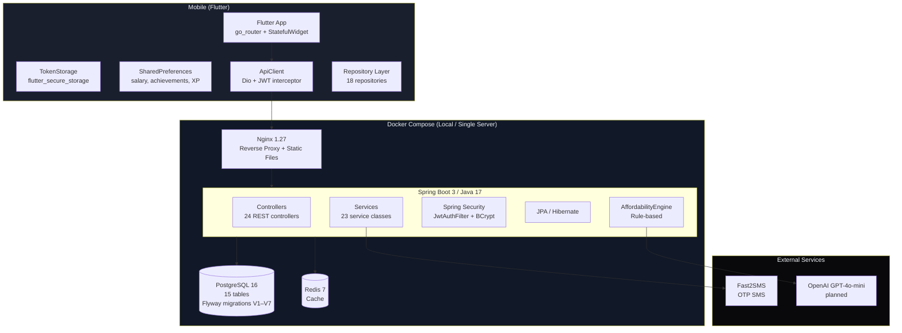

**Current Limitations:**
- All domain logic lives in one JVM process — a single slow query or rogue service call can degrade the entire API
- No background job processing — financial calculations and AI calls happen synchronously on request threads
- Flutter state management is all `StatefulWidget` local state — BLoC is declared but unwired, making global state sharing (auth state, user profile) fragile
- Dashboard data is entirely derived from `SharedPreferences` — no backend sync
- No structured logging or distributed tracing
- CORS is wildcard (`allowedOriginPatterns: ["*"]`) — must be locked down before production

### Future Architecture (Multi-Service Platform, Phase 4)

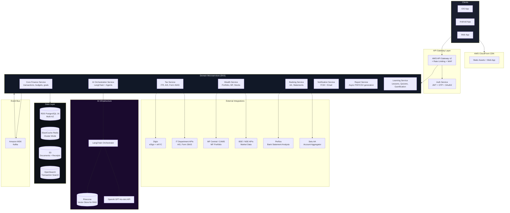

---

## 5. Domain-Driven Design

### Bounded Contexts

```mermaid
graph LR
    subgraph Identity["Identity Context"]
        U[User Aggregate]
        OTP[OTP Value Object]
        JWT_VO[JWT Token Value Object]
    end

    subgraph Finance["Core Finance Context"]
        TXN[Transaction Aggregate]
        BUD[Budget Aggregate]
        GOAL[Goal Aggregate]
        CAT[Category Entity]
        SAV[SavingsRule Entity]
    end

    subgraph Wealth["Wealth Context"]
        PORT[InvestmentPortfolio Aggregate]
        ASSET[Asset Entity]
        LIAB[Liability Entity]
        NW[NetWorth Value Object]
    end

    subgraph Tax["Tax Context"]
        TR[TaxReturn Aggregate]
        DOC[Document Aggregate]
        AIS_VO[AIS Data Value Object]
        DED[Deduction Value Object]
    end

    subgraph AI["AI Context"]
        CHAT[ChatSession Aggregate]
        INSIGHT[Insight Entity]
        AFFORD[AffordabilityCheck Entity]
    end

    subgraph Learning["Learning Context"]
        LP[LearningProgress Aggregate]
        ACH[Achievement Entity]
        QUIZ[QuizResult Value Object]
    end

    subgraph Notification["Notification Context"]
        NOTIF[Notification Aggregate]
        ALERT[AlertRule Entity]
    end

    Identity -->|UserRegistered event| Finance
    Finance -->|TransactionCreated event| AI
    Finance -->|BudgetBreached event| Notification
    Finance -->|TransactionCreated event| Tax
    Wealth -->|PortfolioUpdated event| AI
    Tax -->|DeductionFound event| AI
    AI -->|InsightGenerated event| Notification
    Learning -->|AchievementUnlocked event| Notification
```

### Aggregates, Entities, and Value Objects

#### Identity Context

| Type | Name | Key Fields | Invariants |
|------|------|------------|------------|
| Aggregate Root | User | id, email, passwordHash, monthlyIncome, riskAppetite, pan, taxRegime | Email must be unique; PAN validated against regex; passwordHash never exposed in DTOs |
| Value Object | JwtToken | accessToken, refreshToken, expiresAt | Access token TTL = 1h; refresh TTL = 30d; type claim distinguishes them |
| Value Object | OtpCode | phone, code, expiresAt, attempts | Code is 6 digits; expires in 5 minutes; max 3 attempts before lockout |

#### Core Finance Context

| Type | Name | Key Fields | Invariants |
|------|------|------------|------------|
| Aggregate Root | Transaction | id, userId, amount, direction, categoryId, source, taxCategory | Amount > 0; direction ∈ {DEBIT, CREDIT}; source ∈ {MANUAL, SMS, OCR, BANK_NOTIFICATION, EMAIL} |
| Aggregate Root | Budget | id, userId, categoryId, period, monthlyLimit, spentSoFar | Period format YYYY-MM; spentSoFar cannot exceed 200% of limit (alert at 80%); unique per user+category+period |
| Aggregate Root | Goal | id, userId, name, targetAmount, currentSaved, deadline | currentSaved ≤ targetAmount; deadline ≥ created_at; priority ∈ {low, medium, high} |
| Entity | Category | id, name, type, userId, systemDefault | System categories (userId null) are read-only; custom categories owned by a user |
| Entity | SavingsRule | id, userId, triggerType, config | triggerType ∈ {category_overspend, round_up, surplus_sweep}; config validated by trigger type |
| Value Object | Money | amount, currency | currency always INR in Phase 1–2; multi-currency in Phase 4 |

#### Wealth Context

| Type | Name | Key Fields | Invariants |
|------|------|------------|------------|
| Aggregate Root | InvestmentPortfolio | id, userId, instrumentType, investedAmount, currentValue | instrumentType ∈ {mutual_fund, stock, etf, gold, fd, ppf, nps, bond, reit, sip} |
| Entity | Asset | id, userId, assetType, value, asOfDate | value ≥ 0 |
| Entity | Liability | id, userId, liabilityType, outstanding, interestRate | outstanding ≥ 0; interestRate 0–100 |
| Value Object | NetWorth | totalAssets, totalLiabilities, netWorth, asOfDate | Computed: netWorth = totalAssets − totalLiabilities |

#### Domain Events

| Event | Producer | Consumers | Payload |
|-------|----------|-----------|---------|
| `UserRegistered` | Identity | Finance (seed default categories), Notification (welcome) | userId, email, userType |
| `TransactionCreated` | Finance | AI (categorize), Tax (flag deductions), Notification (overspend check) | transactionId, amount, categoryId, direction |
| `BudgetBreached` | Finance | Notification | userId, categoryId, period, spentPct |
| `GoalAchieved` | Finance | Learning (unlock achievement), Notification | userId, goalId, goalName |
| `AffordabilityChecked` | AI | — | userId, verdict, itemName, price |
| `InsightGenerated` | AI | Notification | userId, insightType, body |
| `AchievementUnlocked` | Learning | Notification | userId, achievementCode, title |
| `ConsentGranted` | Banking | Finance (trigger statement fetch) | userId, consentId, fiTypes |
| `BankStatementFetched` | Banking | Finance (import transactions), AI (analyze) | userId, accountId, statementPeriod |
| `TaxDeductionFound` | Tax | AI (coaching tip), Notification | userId, deductionType, amount, section |

---

## 6. Application Module Structure

### Flutter App — Full Target Folder Structure

```
mobile/
├── lib/
│   ├── main.dart
│   │
│   ├── core/
│   │   ├── constants/
│   │   │   ├── api_constants.dart          # base URL, endpoint strings, storage keys
│   │   │   ├── app_constants.dart          # timeouts, pagination limits, magic numbers
│   │   │   └── route_constants.dart        # route path strings (/dashboard, /goals, …)
│   │   │
│   │   ├── router/
│   │   │   ├── app_router.dart             # GoRouter definition, all routes
│   │   │   ├── main_shell.dart             # StatefulShellRoute bottom nav shell
│   │   │   └── guards/
│   │   │       ├── auth_guard.dart         # redirect if no valid session
│   │   │       └── onboarding_guard.dart   # redirect if onboarding incomplete
│   │   │
│   │   ├── services/
│   │   │   ├── app_services.dart           # singleton service locator
│   │   │   ├── network/
│   │   │   │   ├── api_client.dart         # Dio wrapper, JWT interceptor, auto-refresh
│   │   │   │   └── connectivity_service.dart
│   │   │   ├── storage/
│   │   │   │   ├── token_storage.dart      # flutter_secure_storage (Keychain/Keystore)
│   │   │   │   └── user_prefs_storage.dart # SharedPreferences (salary, XP, achievements)
│   │   │   ├── ai_service.dart             # AI chat, insights via API
│   │   │   ├── sms_parser_service.dart     # flutter_sms_inbox SMS reading (Android)
│   │   │   ├── market_data_service.dart    # live prices (NSE/BSE feed)
│   │   │   └── dashboard_cache.dart        # in-memory dashboard aggregation cache
│   │   │
│   │   ├── theme/
│   │   │   ├── app_colors.dart             # color tokens (dark shell palette)
│   │   │   ├── app_theme.dart              # Material3 ThemeData (DM Sans, dark)
│   │   │   ├── app_typography.dart         # text style scale
│   │   │   └── app_spacing.dart            # spacing constants (4, 8, 12, 16, 24, 32)
│   │   │
│   │   └── utils/
│   │       ├── redirect_utils.dart         # conditional export (web vs stub)
│   │       ├── redirect_utils_web.dart     # web landing page redirect
│   │       ├── redirect_utils_stub.dart    # no-op for mobile
│   │       ├── currency_formatter.dart     # ₹1,23,456 formatting
│   │       ├── date_formatter.dart         # Indian date conventions
│   │       └── validators.dart             # form field validators
│   │
│   ├── design_system/                      # Phase 2: extracted as separate package
│   │   ├── atoms/
│   │   │   ├── pw_button.dart
│   │   │   ├── pw_chip.dart
│   │   │   ├── pw_avatar.dart
│   │   │   └── pw_badge.dart
│   │   ├── molecules/
│   │   │   ├── pw_card.dart
│   │   │   ├── pw_list_tile.dart
│   │   │   ├── pw_stat_card.dart
│   │   │   └── pw_progress_bar.dart
│   │   ├── organisms/
│   │   │   ├── pw_bottom_nav.dart
│   │   │   ├── pw_app_bar.dart
│   │   │   └── pw_empty_state.dart
│   │   └── charts/
│   │       ├── pw_donut_chart.dart
│   │       ├── pw_bar_chart.dart
│   │       └── pw_line_chart.dart
│   │
│   ├── data/
│   │   ├── models/                         # JSON ↔ Dart model classes
│   │   │   ├── user_model.dart
│   │   │   ├── transaction_model.dart
│   │   │   ├── budget_model.dart
│   │   │   ├── goal_model.dart
│   │   │   ├── category_model.dart
│   │   │   ├── investment_model.dart
│   │   │   ├── document_model.dart
│   │   │   ├── savings_rule_model.dart
│   │   │   └── leaderboard_model.dart
│   │   │
│   │   └── repositories/                   # API call wrappers
│   │       ├── auth_repository.dart
│   │       ├── transaction_repository.dart
│   │       ├── budget_repository.dart
│   │       ├── goal_repository.dart
│   │       ├── category_repository.dart
│   │       ├── affordability_repository.dart
│   │       ├── health_score_repository.dart
│   │       ├── investment_repository.dart
│   │       ├── user_repository.dart
│   │       ├── net_worth_repository.dart
│   │       ├── savings_rule_repository.dart
│   │       ├── leaderboard_repository.dart
│   │       ├── document_repository.dart
│   │       ├── learning_repository.dart
│   │       └── notifications_repository.dart
│   │
│   ├── features/
│   │   ├── authentication/
│   │   │   ├── domain/entities/user_entity.dart
│   │   │   ├── bloc/                       # Phase 2: AuthBloc
│   │   │   └── presentation/screens/
│   │   │       ├── splash_screen.dart
│   │   │       ├── login_screen.dart
│   │   │       ├── register_screen.dart
│   │   │       └── onboarding_goal_setup_screen.dart
│   │   │
│   │   ├── dashboard/
│   │   │   ├── domain/entities/dashboard_summary.dart
│   │   │   ├── bloc/                       # Phase 2: DashboardBloc
│   │   │   └── presentation/
│   │   │       ├── screens/
│   │   │       │   ├── dashboard_screen.dart
│   │   │       │   ├── salary_detail_screen.dart
│   │   │       │   ├── savings_detail_screen.dart
│   │   │       │   ├── investment_detail_screen.dart
│   │   │       │   └── budget_detail_screen.dart
│   │   │       └── widgets/
│   │   │           ├── summary_card.dart
│   │   │           ├── hero_carousel_section.dart
│   │   │           ├── animated_stats_section.dart
│   │   │           ├── market_data_section.dart
│   │   │           ├── motivation_cards_section.dart
│   │   │           ├── news_ticker_widget.dart
│   │   │           └── detail_screen_widgets.dart
│   │   │
│   │   ├── transactions/
│   │   ├── budget/
│   │   ├── goals/
│   │   ├── calculator/                     # affordability checker
│   │   ├── reports/
│   │   ├── ai/
│   │   │   └── chat/
│   │   ├── investments/
│   │   ├── net_worth/
│   │   ├── learn/
│   │   ├── notifications/
│   │   ├── profile/
│   │   ├── settings/
│   │   ├── documents/
│   │   ├── savings_rules/
│   │   ├── leaderboard/
│   │   ├── sms/
│   │   ├── insights/
│   │   ├── about/
│   │   └── contact/
│   │
│   └── shared/
│       └── widgets/
│           └── placeholder_screen.dart
│
├── test/
│   ├── unit/
│   ├── widget/
│   └── integration/
│
├── assets/
│   ├── images/
│   ├── icons/
│   ├── lottie/
│   └── fonts/
│
└── pubspec.yaml
```

### Backend — Full Package Structure (Current Monolith, Target Modular Monolith)

```
backend/src/main/java/com/pennywise/
│
├── PennywiseApplication.java
│
├── config/
│   ├── JpaAuditingConfig.java              # @EnableJpaAuditing
│   ├── RedisConfig.java                    # Phase 2: RedisTemplate beans
│   ├── OpenApiConfig.java                  # Springdoc OpenAPI 3 config
│   └── security/
│       ├── SecurityConfig.java             # filter chain, CORS, BCrypt
│       ├── JwtAuthFilter.java              # OncePerRequestFilter
│       └── JwtService.java                 # token generation + validation
│
├── entity/                                 # JPA entities (one per table)
│   ├── BaseEntity.java                     # id (UUID), createdAt, updatedAt
│   ├── User.java
│   ├── Category.java
│   ├── Transaction.java
│   ├── Budget.java
│   ├── Goal.java
│   ├── InvestmentPortfolio.java
│   ├── Asset.java
│   ├── Liability.java
│   ├── LearningProgress.java
│   ├── Achievement.java
│   ├── SavingsRule.java
│   ├── Notification.java
│   ├── Document.java
│   └── ChatMessage.java
│
├── repository/                             # Spring Data JPA interfaces
│   └── [one per entity]
│
├── dto/                                    # request/response POJOs
│   ├── auth/
│   │   ├── RegisterRequest.java
│   │   ├── LoginRequest.java
│   │   ├── RefreshRequest.java
│   │   ├── OtpRequest.java
│   │   ├── OtpSendResponse.java
│   │   ├── OtpVerifyRequest.java
│   │   └── AuthResponse.java
│   └── [domain DTOs]
│
├── controller/                             # REST controllers
│   ├── AuthController.java
│   ├── UserController.java
│   ├── TransactionController.java
│   ├── BudgetController.java
│   ├── GoalController.java
│   ├── CategoryController.java
│   ├── AffordabilityController.java
│   ├── ChatController.java
│   ├── InvestmentPortfolioController.java
│   ├── NetWorthController.java
│   ├── ReportController.java
│   ├── NotificationController.java
│   ├── LearningController.java
│   ├── LeaderboardController.java
│   ├── HealthScoreController.java
│   ├── SavingsRuleController.java
│   ├── DocumentController.java
│   └── FinancialGraphController.java
│
├── service/                                # business logic
│   ├── AuthService.java
│   ├── OtpService.java
│   ├── UserService.java
│   ├── TransactionService.java
│   ├── BudgetService.java
│   ├── GoalService.java
│   ├── CategoryService.java
│   ├── AffordabilityService.java
│   ├── ChatService.java
│   ├── InvestmentPortfolioService.java
│   ├── NetWorthService.java
│   ├── ReportService.java
│   ├── NotificationService.java
│   ├── LearningService.java
│   ├── LeaderboardService.java
│   ├── HealthScoreService.java
│   ├── SavingsRuleService.java
│   ├── DocumentService.java
│   ├── FinancialGraphService.java
│   └── CurrentUserProvider.java            # resolves authenticated user from SecurityContext
│
├── ai/
│   ├── AffordabilityEngine.java            # rule-based affordability logic
│   ├── CategorizationEngine.java           # Phase 2: ML/LLM categorization
│   ├── HealthScoreEngine.java              # Phase 2: dynamic score calculation
│   └── agents/                             # Phase 3: LangChain agent wrappers
│       ├── FinancialCoachAgent.java
│       ├── TaxAssistantAgent.java
│       └── InvestmentAdvisorAgent.java
│
├── exception/
│   ├── GlobalExceptionHandler.java
│   ├── ErrorResponse.java
│   ├── ResourceNotFoundException.java
│   └── DuplicateResourceException.java
│
└── resources/
    ├── application.yml
    ├── application-dev.yml
    ├── application-prod.yml
    └── db/migration/
        ├── V1__init.sql
        ├── V2__seed_default_categories.sql
        ├── V3__chat_history_updated_at.sql
        ├── V4__category_icons.sql
        ├── V5__tax_ready_schema.sql
        ├── V6__learning_notifications_audit_columns.sql
        └── V7__phone_auth.sql
```

---

## 7. Shared Engine Architecture

The core pipeline transforms raw financial data into actionable intelligence:

```
Transaction Engine → Categorization Engine → Document Engine → AI Engine
    → Tax Engine → Investment Engine → Financial Health Engine → Recommendation Engine
```

### 7.1 Transaction Engine

**Inputs:** Raw transaction data from SMS (flutter_sms_inbox), manual entry, OCR, bank statement (AA feed)  
**Outputs:** Normalized Transaction records with amount, direction, merchant, payment_method, source  
**Responsibilities:**
- Deduplicate transactions from multiple sources (SMS + bank statement might both capture the same UPI payment)
- Validate amounts (non-negative, within plausible range for user's income profile)
- Assign `transaction_date` from source timestamp, not server receipt time
- Mark `recurring = true` when the same merchant+amount pattern repeats for 2+ consecutive months

**Implementation:** `TransactionService.java` (current) + a future `DeduplicationJob` (Spring Batch, Phase 2)

### 7.2 Categorization Engine

**Inputs:** Transaction merchant string, amount, direction, user's past categorization patterns  
**Outputs:** `category_id`, `category_confidence` (0.0–1.0)  
**Responsibilities:**
- Phase 1 (current): user manually selects category on entry
- Phase 2: rule-based keyword matching (Swiggy → Food, Uber → Transport, SBI → Banking)
- Phase 2.5: LLM call to GPT-4o-mini with merchant name + amount context → returns category + confidence
- Phase 3: user feedback loop — when user overrides AI category, the correction is stored and used to fine-tune prompts

**Implementation:** `CategorizationEngine.java` (planned), called async from `TransactionService` via event after save

### 7.3 Document Engine

**Inputs:** PDF/image files (Form 16, receipts, insurance policies), uploaded via API or picked by ML Kit  
**Outputs:** Structured `ocr_data` JSON, `document_type`, `tax_category`, linked `transaction_id`  
**Responsibilities:**
- Invoke Google ML Kit Text Recognition (mobile-side) for receipts → extract merchant, amount, date
- Invoke server-side Tika/Tesseract for PDF documents (Form 16, bank statements)
- Classify document type automatically from content patterns
- Link extracted transactions to existing transaction records if date+amount match
- Store file in S3 with pre-signed URL; store only the URL in PostgreSQL (never the binary)

**Implementation:** `DocumentService.java` (stub) + ML Kit on Flutter side (google_mlkit_text_recognition declared)

### 7.4 AI Engine

**Inputs:** User financial context (income, spending by category, goals, portfolio), user message (for chat), trigger event type (for proactive insights)  
**Outputs:** Natural language response, structured insight object, or affordability verdict  
**Responsibilities:**
- Manage LangChain agent selection based on query intent classification
- Inject user financial context as a structured system prompt preamble (never raw PII in prompt)
- Maintain conversation memory (last N turns from `chat_history` table)
- Rate-limit LLM calls per user (max 20 chat messages/day on free tier)
- Fall back gracefully when OpenAI API is unavailable (return cached last insight)

**Implementation:** `ChatService.java` + `AffordabilityEngine.java` (rule layer, complete) + `agents/` package (Phase 3)

### 7.5 Tax Engine

**Inputs:** Transactions with `tax_category` flags, documents (Form 16, AIS), user profile (PAN, taxRegime, financial_year_start)  
**Outputs:** Tax summary, deduction recommendations, ITR draft data, advance tax schedule  
**Responsibilities:**
- Calculate taxable income under both OLD and NEW regime, show comparison
- Identify unclaimed deductions from transaction data (80C investments, 80D insurance premiums, HRA)
- Fetch AIS (Annual Information Statement) from IT Department API using user's PAN
- Generate ITR-1 / ITR-2 JSON in the schema required by IT Department filing portal
- Track advance tax due dates (June 15, September 15, December 15, March 15) and notify

**Implementation:** `TaxService.java` (Phase 3, new service)

### 7.6 Investment Engine

**Inputs:** `investment_portfolio` records, market data (NSE/BSE API), user risk appetite, goal amounts  
**Outputs:** Portfolio summary, XIRR, asset allocation analysis, rebalancing recommendations  
**Responsibilities:**
- Fetch live NAV for mutual funds from AMFI / MF Central
- Calculate XIRR for portfolio and individual holdings
- Compare allocation vs target (based on risk appetite: conservative/balanced/aggressive)
- Generate SIP recommendations based on goal gap and timeline

**Implementation:** `InvestmentPortfolioService.java` (stub) + market data polling job (Phase 3)

### 7.7 Financial Health Engine

**Inputs:** All transaction data for the period, budget vs actual, goal progress, emergency fund level, debt-to-income ratio  
**Outputs:** Composite health score (0–100), sub-scores by dimension, trend vs last period  
**Responsibilities:**
- Score five dimensions, each 0–20:
  1. Savings rate (actual savings / income, target: 20%)
  2. Budget adherence (categories within limit, target: all within)
  3. Debt burden (EMI / income, target: < 30%)
  4. Emergency fund (months of expenses saved, target: 6+)
  5. Goal progress (on-track goals / total goals, target: all on track)
- Recalculate at end of each month or on-demand
- Store score history for trend display

**Implementation:** `HealthScoreService.java` (stub) + `HealthScoreEngine.java` (planned)

### 7.8 Recommendation Engine

**Inputs:** All engine outputs, user behavioral patterns (quiz completion, feature usage), peer cohort data (anonymized)  
**Outputs:** Prioritized list of recommendations, each with: title, body, action_type, expected_impact  
**Responsibilities:**
- Deduplicate: do not show the same recommendation within 7 days
- Prioritize: a recommendation that saves ₹5,000/month ranks above one that saves ₹200
- Personalize: students get different recommendations than professionals at the same income level
- Measure: track whether user acted on the recommendation; use this to improve ranking

**Implementation:** `RecommendationService.java` (Phase 3), writes to `notifications` table with type=`recommendation`

---

## 8. Reusable Design System Architecture

### Design Philosophy

PennyWise AI uses a dark-shell design language that communicates trust, precision, and premium intelligence. The palette is drawn from the current `app_colors.dart` and `app_theme.dart`. The typography is DM Sans (Google Fonts) — a geometric sans-serif that reads clearly at small sizes on mobile.

### Color Token System

```dart
// Backgrounds — layered depth creates visual hierarchy
background      = #09090B   // deepest layer (scaffold)
surface         = #111827   // cards, bottom nav
surfaceElevated = #1A1F2E   // modals, dropdowns, focused cards
border          = #1E2535   // dividers, input borders

// Brand
primary  = #F4722B   // CTA buttons, active nav, progress
accent   = #FFB830   // highlights, warnings, gold status

// Semantic
success  = #22C55E
danger   = #EF4444
warning  = #F59E0B

// Trust signals (hero gradients, primary nav)
blue     = #3B82F6
indigo   = #6366F1
deepBlue = #1E3A8A

// Text scale
textPrimary   = #F1F5F9   // headings, active labels
textSecondary = #8A8FA8   // supporting text, placeholders
textMuted     = #4A4F62   // disabled, metadata

// Money card gradients (gradient pairs, left to right)
salaryGradient  = [#1D4ED8, #06B6D4]   // blue → cyan
savingsGradient = [#059669, #22C55E]   // emerald → green
investGradient  = [#6D28D9, #8B5CF6]  // purple → violet
budgetGradient  = [#D97706, #F97316]   // amber → orange
```

### Typography Scale

| Token | Font | Weight | Size | Use |
|-------|------|--------|------|-----|
| `displayLarge` | DM Sans | 700 | 32sp | Hero numbers (₹ amount) |
| `displayMedium` | DM Sans | 700 | 24sp | Screen titles |
| `titleLarge` | DM Sans | 600 | 20sp | Card headers |
| `titleMedium` | DM Sans | 600 | 16sp | Section headers |
| `bodyLarge` | DM Sans | 400 | 16sp | Body copy |
| `bodyMedium` | DM Sans | 400 | 14sp | Secondary body |
| `labelLarge` | DM Sans | 600 | 14sp | Button labels |
| `labelMedium` | DM Sans | 500 | 12sp | Chip labels, badges |
| `labelSmall` | DM Sans | 400 | 11sp | Metadata, timestamps |

### Spacing System

All spacing is on an 8pt grid. Named tokens:

| Token | Value | Use |
|-------|-------|-----|
| `xs` | 4 | Icon padding, dense lists |
| `sm` | 8 | Between related elements |
| `md` | 12 | Card inner padding (compact) |
| `lg` | 16 | Card inner padding (standard) |
| `xl` | 24 | Section spacing |
| `xxl` | 32 | Screen top padding |
| `xxxl` | 48 | Hero spacing |

### Border Radius Scale

| Token | Value | Use |
|-------|-------|-----|
| `sm` | 8 | Chips, badges |
| `md` | 14 | Input fields |
| `lg` | 16 | Buttons |
| `xl` | 20 | Cards (current CardTheme) |
| `xxl` | 24 | Bottom sheets |
| `full` | 999 | Pills, avatars |

### Component Specifications

**PwButton (Primary)**
- Background: `primary` (#F4722B)
- Text: white, DM Sans 700, 15sp
- Padding: 16v × 24h
- Border radius: 16
- State — disabled: opacity 0.4
- State — loading: shows CircularProgressIndicator (white, size 20)

**PwCard**
- Background: `surface` (#111827)
- Border: 1px `border` (#1E2535)
- Border radius: 20
- Elevation: 0 (shadow via border, not elevation)
- Margin: zero (caller controls spacing)

**PwStatCard (Dashboard Summary Cards)**
- Gradient fill from the money card gradient pairs
- Title: `labelMedium` (white, 70% opacity)
- Value: `displayLarge` (white)
- Subtitle: `labelSmall` (white, 60% opacity)
- Tap: navigates to detail screen with salary/amount as query param

**PwBottomNav**
- Background: `surface`
- Active icon + label: `primary`
- Inactive: `textSecondary`
- 5 tabs: Dashboard, Transactions, Goals, Learn, Chat
- No elevation — uses 1px top border in `border` color

**PwEmptyState**
- Illustration (Lottie or SVG asset)
- Title: `titleMedium`
- Body: `bodyMedium` in `textSecondary`
- Optional CTA button

**PwChart — Donut Chart**
- Built on `fl_chart`
- Sections use `success`, `primary`, `blue`, `warning`, `danger` cycling
- Center label: `displayMedium` + `labelSmall` subtitle
- Legend: horizontal wrap, `labelSmall` with color dot

**PwChart — Bar Chart**
- Gradient bars (category color → transparent)
- X-axis: month labels in `labelSmall` `textMuted`
- Y-axis: ₹ formatted values
- Touch tooltip: `surface` background, `labelMedium` text

### Lottie / Animation Assets (planned for Phase 2)

| Asset | Trigger | Duration |
|-------|---------|----------|
| `achievement_unlock.json` | Achievement earned | 1.5s, play once |
| `confetti.json` | Goal achieved | 2s, play once |
| `ai_thinking.json` | AI response loading | Loop until response |
| `empty_transactions.json` | Empty transaction list | Loop |
| `success_check.json` | Form submission success | 0.8s |

---

## 9. Database Evolution Roadmap

### Current Schema — Entity Relationship Diagram

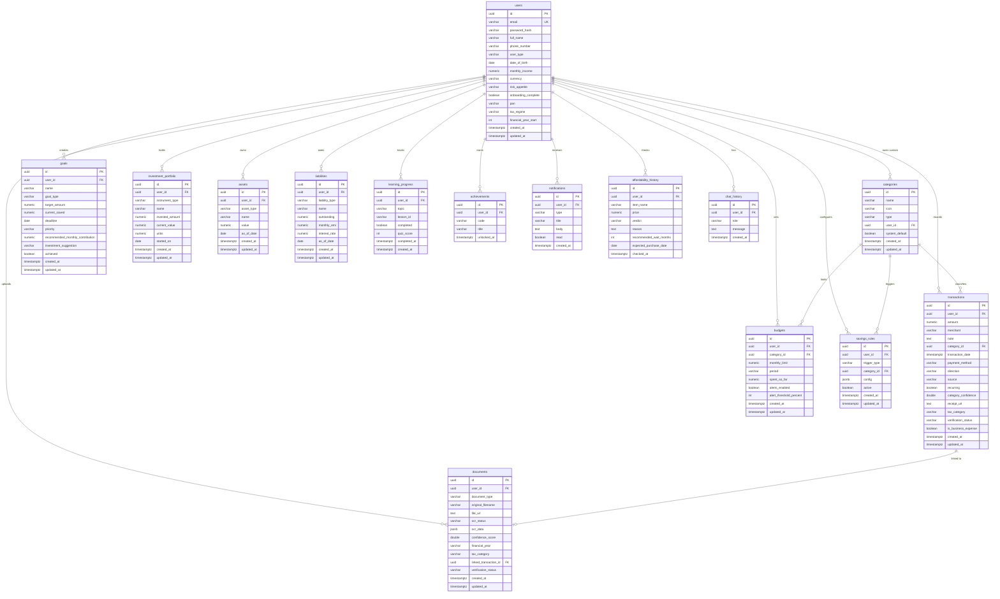

### Phase 2 Schema Additions (V8–V12 Migrations)

```sql
-- V8: Financial health score history
CREATE TABLE health_score_history (
    id           uuid PRIMARY KEY DEFAULT gen_random_uuid(),
    user_id      uuid NOT NULL REFERENCES users(id) ON DELETE CASCADE,
    score        int NOT NULL CHECK (score BETWEEN 0 AND 100),
    savings_score   int,
    budget_score    int,
    debt_score      int,
    emergency_score int,
    goals_score     int,
    period       varchar(7) NOT NULL,   -- YYYY-MM
    calculated_at timestamptz DEFAULT now()
);

-- V9: SMS import tracking (deduplication)
CREATE TABLE sms_imports (
    id           uuid PRIMARY KEY DEFAULT gen_random_uuid(),
    user_id      uuid NOT NULL REFERENCES users(id) ON DELETE CASCADE,
    sms_hash     varchar(64) NOT NULL,  -- SHA-256 of raw SMS body
    transaction_id uuid REFERENCES transactions(id) ON DELETE SET NULL,
    imported_at  timestamptz DEFAULT now(),
    UNIQUE (user_id, sms_hash)
);

-- V10: Savings rule execution log
CREATE TABLE savings_rule_executions (
    id           uuid PRIMARY KEY DEFAULT gen_random_uuid(),
    rule_id      uuid NOT NULL REFERENCES savings_rules(id) ON DELETE CASCADE,
    triggered_at timestamptz DEFAULT now(),
    amount_moved numeric(14,2),
    status       varchar(16) DEFAULT 'SIMULATED'  -- SIMULATED | EXECUTED | FAILED
);

-- V11: FCM push token registry
CREATE TABLE user_devices (
    id           uuid PRIMARY KEY DEFAULT gen_random_uuid(),
    user_id      uuid NOT NULL REFERENCES users(id) ON DELETE CASCADE,
    fcm_token    text NOT NULL,
    platform     varchar(8) NOT NULL,  -- ANDROID | IOS | WEB
    registered_at timestamptz DEFAULT now(),
    last_seen    timestamptz DEFAULT now(),
    UNIQUE (fcm_token)
);

-- V12: Notification read receipt & action tracking
ALTER TABLE notifications ADD COLUMN action_url text;
ALTER TABLE notifications ADD COLUMN read_at timestamptz;
ALTER TABLE notifications ADD COLUMN actioned boolean DEFAULT false;
ALTER TABLE notifications ADD COLUMN actioned_at timestamptz;
```

### Phase 3 Schema Additions (V13–V18 Migrations)

```sql
-- V13: Tax return tracker
CREATE TABLE tax_returns (
    id              uuid PRIMARY KEY DEFAULT gen_random_uuid(),
    user_id         uuid NOT NULL REFERENCES users(id) ON DELETE CASCADE,
    financial_year  varchar(7) NOT NULL,     -- "2025-26"
    status          varchar(32) DEFAULT 'DRAFT',
    itr_form        varchar(8),              -- ITR-1 | ITR-2 | ITR-3
    gross_income    numeric(14,2),
    taxable_income  numeric(14,2),
    tax_payable     numeric(14,2),
    tax_paid        numeric(14,2),
    refund_amount   numeric(14,2),
    filing_date     timestamptz,
    ack_number      varchar(64),
    created_at      timestamptz DEFAULT now(),
    updated_at      timestamptz DEFAULT now(),
    UNIQUE (user_id, financial_year)
);

-- V14: Connected bank accounts (AA)
CREATE TABLE connected_accounts (
    id              uuid PRIMARY KEY DEFAULT gen_random_uuid(),
    user_id         uuid NOT NULL REFERENCES users(id) ON DELETE CASCADE,
    fip_id          varchar(64) NOT NULL,    -- AA Financial Information Provider ID
    account_type    varchar(32),             -- SAVINGS | CURRENT | CREDIT_CARD | FD | etc.
    masked_account  varchar(64),
    institution     varchar(128),
    consent_id      varchar(128),
    consent_expiry  timestamptz,
    last_fetched    timestamptz,
    active          boolean DEFAULT true,
    created_at      timestamptz DEFAULT now()
);

-- V15: Capital gains tracking
CREATE TABLE capital_gains (
    id              uuid PRIMARY KEY DEFAULT gen_random_uuid(),
    user_id         uuid NOT NULL REFERENCES users(id) ON DELETE CASCADE,
    asset_type      varchar(32) NOT NULL,    -- EQUITY | MF_EQUITY | MF_DEBT | PROPERTY | GOLD
    isin            varchar(12),
    buy_date        date NOT NULL,
    sell_date       date,
    buy_price       numeric(14,2) NOT NULL,
    sell_price      numeric(14,2),
    units           numeric(18,6),
    gain_type       varchar(8),              -- STCG | LTCG
    gain_amount     numeric(14,2),
    tax_year        varchar(7),
    created_at      timestamptz DEFAULT now()
);

-- V16: Insurance policies
CREATE TABLE insurance_policies (
    id              uuid PRIMARY KEY DEFAULT gen_random_uuid(),
    user_id         uuid NOT NULL REFERENCES users(id) ON DELETE CASCADE,
    policy_type     varchar(32) NOT NULL,    -- LIFE | HEALTH | TERM | VEHICLE | HOME
    insurer         varchar(128),
    policy_number   varchar(64),
    sum_insured     numeric(14,2),
    annual_premium  numeric(14,2),
    start_date      date,
    end_date        date,
    section_80d_eligible boolean DEFAULT false,
    created_at      timestamptz DEFAULT now()
);

-- V17: Recurring payment tracker
CREATE TABLE recurring_payments (
    id              uuid PRIMARY KEY DEFAULT gen_random_uuid(),
    user_id         uuid NOT NULL REFERENCES users(id) ON DELETE CASCADE,
    name            varchar(255) NOT NULL,
    amount          numeric(14,2) NOT NULL,
    frequency       varchar(16) NOT NULL,    -- MONTHLY | QUARTERLY | ANNUALLY
    next_due_date   date,
    category_id     uuid REFERENCES categories(id),
    auto_detected   boolean DEFAULT false,
    active          boolean DEFAULT true,
    created_at      timestamptz DEFAULT now()
);

-- V18: Audit log for compliance (DPDP)
CREATE TABLE audit_log (
    id           uuid PRIMARY KEY DEFAULT gen_random_uuid(),
    user_id      uuid REFERENCES users(id) ON DELETE SET NULL,
    action       varchar(128) NOT NULL,  -- DATA_EXPORT | CONSENT_GRANT | CONSENT_REVOKE | LOGIN | PROFILE_UPDATE
    resource     varchar(128),
    ip_address   inet,
    user_agent   text,
    metadata     jsonb,
    created_at   timestamptz DEFAULT now()
);
CREATE INDEX idx_audit_log_user ON audit_log(user_id, created_at DESC);
```

### Phase 4 Schema Additions (V19–V22 Migrations)

```sql
-- V19: Multi-currency support
ALTER TABLE users ADD COLUMN base_currency varchar(3) DEFAULT 'INR';
ALTER TABLE transactions ADD COLUMN original_currency varchar(3);
ALTER TABLE transactions ADD COLUMN original_amount numeric(14,2);
ALTER TABLE transactions ADD COLUMN exchange_rate numeric(10,6);

-- V20: Business expense tracking (GST)
CREATE TABLE gst_records (
    id           uuid PRIMARY KEY DEFAULT gen_random_uuid(),
    user_id      uuid NOT NULL REFERENCES users(id) ON DELETE CASCADE,
    transaction_id uuid REFERENCES transactions(id),
    gstin        varchar(15),
    invoice_number varchar(64),
    gst_amount   numeric(14,2),
    igst         numeric(14,2),
    cgst         numeric(14,2),
    sgst         numeric(14,2),
    tax_year     varchar(7),
    created_at   timestamptz DEFAULT now()
);

-- V21: Family / joint accounts
CREATE TABLE family_groups (
    id           uuid PRIMARY KEY DEFAULT gen_random_uuid(),
    name         varchar(128) NOT NULL,
    owner_id     uuid NOT NULL REFERENCES users(id),
    created_at   timestamptz DEFAULT now()
);
CREATE TABLE family_members (
    group_id     uuid REFERENCES family_groups(id) ON DELETE CASCADE,
    user_id      uuid REFERENCES users(id) ON DELETE CASCADE,
    role         varchar(16) DEFAULT 'MEMBER',  -- OWNER | MEMBER | VIEW_ONLY
    joined_at    timestamptz DEFAULT now(),
    PRIMARY KEY (group_id, user_id)
);

-- V22: AI agent evaluation log
CREATE TABLE ai_evaluation_log (
    id             uuid PRIMARY KEY DEFAULT gen_random_uuid(),
    user_id        uuid REFERENCES users(id) ON DELETE SET NULL,
    agent_type     varchar(32) NOT NULL,
    prompt_hash    varchar(64),
    response_hash  varchar(64),
    latency_ms     int,
    user_rating    int CHECK (user_rating BETWEEN 1 AND 5),
    feedback_text  text,
    created_at     timestamptz DEFAULT now()
);
```

---

## 10. API Roadmap

### Versioning Strategy

- Current: unversioned (`/api/...`) — acceptable for a single-client private API
- Phase 2 onwards: URL-based versioning (`/api/v1/...`, `/api/v2/...`)
- Breaking changes require a new major version; non-breaking additions are allowed within a version
- Old versions deprecated with a `Sunset` header, removed after 90 days

### Standard Request/Response Format

All requests use `Content-Type: application/json`. Authentication is via `Authorization: Bearer <access_token>`.

Success response (single resource):
```json
{
  "data": { ... }
}
```

Success response (collection):
```json
{
  "data": [ ... ],
  "meta": {
    "total": 243,
    "page": 1,
    "pageSize": 20,
    "hasNext": true
  }
}
```

Error response:
```json
{
  "timestamp": "2026-08-01T10:30:00Z",
  "status": 400,
  "error": "Bad Request",
  "message": "Validation failed",
  "path": "/api/transactions",
  "fieldErrors": {
    "amount": "must be greater than 0"
  }
}
```

### Phase 1 — Completed Endpoints

| Method | Endpoint | Description | Auth |
|--------|----------|-------------|------|
| POST | /auth/register | Register new user, returns JWT pair | No |
| POST | /auth/login | Email + password login, returns JWT pair | No |
| POST | /auth/refresh | Rotate access token using refresh token | No |
| POST | /auth/send-otp | Send SMS OTP to phone number | No |
| POST | /auth/verify-otp | Verify OTP, returns JWT pair | No |
| GET | /categories | List system + user categories | Yes |
| POST | /transactions | Create manual transaction | Yes |
| GET | /transactions | List user transactions (paginated) | Yes |
| DELETE | /transactions/{id} | Soft-delete transaction | Yes |
| POST | /budgets | Create budget for category+period | Yes |
| GET | /budgets | List active budgets | Yes |
| POST | /goals | Create savings goal | Yes |
| GET | /goals | List goals | Yes |
| PATCH | /goals/{id}/saved-amount | Update saved amount on goal | Yes |
| POST | /affordability/check | Run affordability engine | Yes |

### Phase 2 — Planned Endpoints

| Method | Endpoint | Description |
|--------|----------|-------------|
| GET | /users/me | Get current user profile |
| PATCH | /users/me | Update profile (salary, risk appetite, name) |
| GET | /dashboard | Aggregated dashboard data (salary, savings, budget, goals summary) |
| POST | /ai/chat | Send message to AI coach, get response |
| GET | /ai/chat/history | Retrieve paginated chat history |
| GET | /notifications | List user notifications (unread first) |
| PATCH | /notifications/{id}/read | Mark notification as read |
| POST | /notifications/read-all | Mark all as read |
| GET | /reports/spending | Monthly spending by category (bar chart data) |
| GET | /reports/savings-trend | Monthly savings trend (line chart data) |
| GET | /reports/summary | Period summary (income, spending, savings, net) |
| GET | /health-score | Current financial health score + sub-scores |
| GET | /health-score/history | Historical scores (last 12 months) |
| GET | /ai/insights | Latest AI-generated insights for user |
| POST | /savings-rules | Create savings automation rule |
| GET | /savings-rules | List active rules |
| PATCH | /savings-rules/{id} | Update rule |
| DELETE | /savings-rules/{id} | Delete rule |
| GET | /learning/lessons | List available lessons |
| POST | /learning/progress | Update lesson completion + quiz score |
| GET | /learning/progress | Get all learning progress |
| GET | /leaderboard | Top users by XP (opt-in) |
| GET | /achievements | Current user's achievements |
| GET | /categories | List categories (add POST for custom) |
| POST | /categories | Create custom category |

### Phase 3 — Planned Endpoints

| Method | Endpoint | Description |
|--------|----------|-------------|
| POST | /investments | Add investment holding |
| GET | /investments | List portfolio |
| PATCH | /investments/{id} | Update current value |
| DELETE | /investments/{id} | Remove holding |
| GET | /net-worth | Current net worth summary |
| POST | /assets | Add asset |
| GET | /assets | List assets |
| POST | /liabilities | Add liability |
| GET | /liabilities | List liabilities |
| POST | /documents | Upload document metadata (S3 pre-signed URL flow) |
| GET | /documents | List documents |
| GET | /documents/{id} | Get document + OCR data |
| DELETE | /documents/{id} | Delete document |
| POST | /banking/consent | Initiate AA consent flow |
| GET | /banking/consent/{consentId} | Check consent status |
| POST | /banking/fetch | Trigger bank statement fetch |
| GET | /banking/accounts | List connected accounts |
| GET | /tax/summary | Tax year summary (income, deductions, payable) |
| GET | /tax/deductions | Identified deductions from transactions |
| GET | /tax/capital-gains | Capital gains summary |
| POST | /tax/documents/ais | Trigger AIS fetch |
| POST | /affordability/check | (Enhanced: uses real portfolio data) |

### Phase 4 — Planned Endpoints

| Method | Endpoint | Description |
|--------|----------|-------------|
| GET | /tax/itr/draft | Generate ITR draft JSON |
| POST | /tax/itr/file | Submit ITR to IT Department |
| GET | /tax/itr/status | Check filing status + refund |
| GET | /family/group | Get family group details |
| POST | /family/invite | Invite member to family group |
| GET | /family/dashboard | Joint family financial view |
| GET | /reports/export | Export transactions as CSV/PDF |
| POST | /ai/financial-plan | Generate 5-year financial plan |
| GET | /market/mutual-funds | Search + compare mutual funds |
| GET | /market/stocks | NSE/BSE stock data |

---

## 11. AI Agent Architecture

### Overview

The AI layer is built on LangChain (Python microservice in Phase 3) or LangChain4j (Java, if remaining in monolith). Five specialized agents handle different user intents, all orchestrated by a Router Agent that classifies the incoming query.

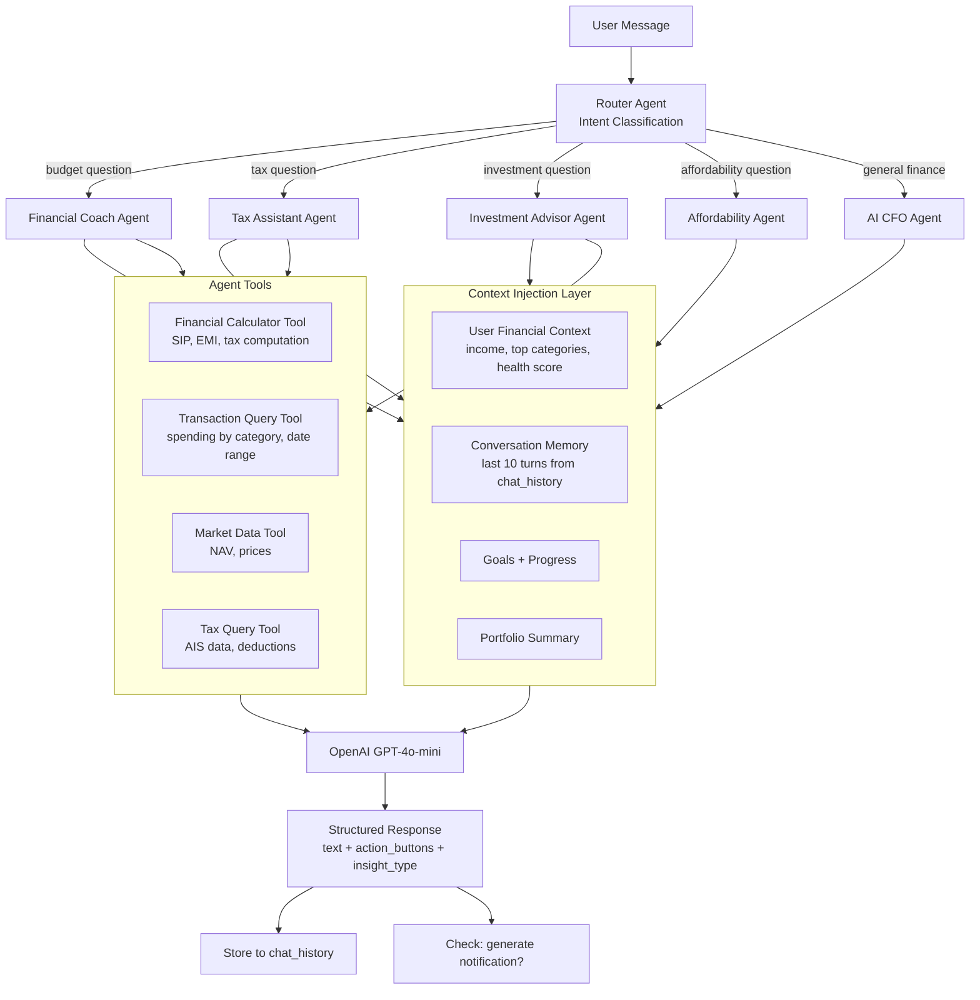

### Agent Specifications

**Router Agent**
- Input: raw user message
- Tool: zero-shot classification prompt with few-shot examples
- Output: `{intent: "budget" | "tax" | "investment" | "affordability" | "general", confidence: 0.0–1.0}`
- Fallback: if confidence < 0.6, route to CFO Agent

**Financial Coach Agent**
- Persona: "A friendly CA who has known you for years"
- Tone: encouraging, specific, never condescending
- Context injected: last 30 days of spending by category, budget vs actual, health score
- Capabilities: identify overspending patterns, suggest category-specific cuts, celebrate wins
- Prompt template includes: user income bracket, user_type (student/professional), risk_appetite

**Tax Assistant Agent**
- Persona: "Your personal CA during tax season"
- Context injected: transactions with tax_category flags, user's PAN, taxRegime, financial_year
- Capabilities: old vs new regime comparison, deduction suggestions (80C, 80D, HRA), advance tax reminders
- Guardrails: never give definitive tax filing advice — append "verify with a CA before filing"

**Investment Advisor Agent**
- Persona: "A SEBI-registered investment advisor's junior"
- Context injected: portfolio holdings, risk_appetite, goals and timelines
- Capabilities: suggest allocation adjustments, explain instruments (SIP, SGB, NPS), calculate SIP for goal
- Guardrails: always include "Past returns are not indicative of future results"

**Affordability Agent**
- Wraps the existing Java `AffordabilityEngine` rule logic
- LLM layer adds: explain the verdict in plain language, suggest alternatives, motivate the WAIT_AND_SAVE path
- Always shows the numbers (emergency fund before/after, months to save) — P1 Explainability principle

**AI CFO Agent**
- Handles general financial questions not caught by specialized agents
- Context injected: full financial snapshot (income, networth, goals, health score)
- Acts as orchestrator for multi-step queries ("should I prepay my home loan or invest the surplus?")

### Prompt Memory Architecture

```
System Prompt:
  [Persona] + [User Financial Context] + [Guardrails]

Human Turn 1: [user message, turn -9]
Assistant Turn 1: [agent response, turn -9]
...
Human Turn 10: [user message, current]
```

Context window budget per agent call:
- System prompt (persona + financial context): ~600 tokens
- Conversation history (last 10 turns): ~800 tokens
- User message: ~100 tokens
- Tools output: ~300 tokens
- Total: ~1800 tokens — leaves 2,200 tokens for response at gpt-4o-mini 4k context

For users with large transaction histories (Phase 3+), context is compressed using `FinancialGraphService.toPromptContext()` — a compact text summary of nodes and edges that conveys the same semantic content in ~150 tokens instead of ~1,500 raw JSON tokens.

---

## 12. Feature Dependency Graph

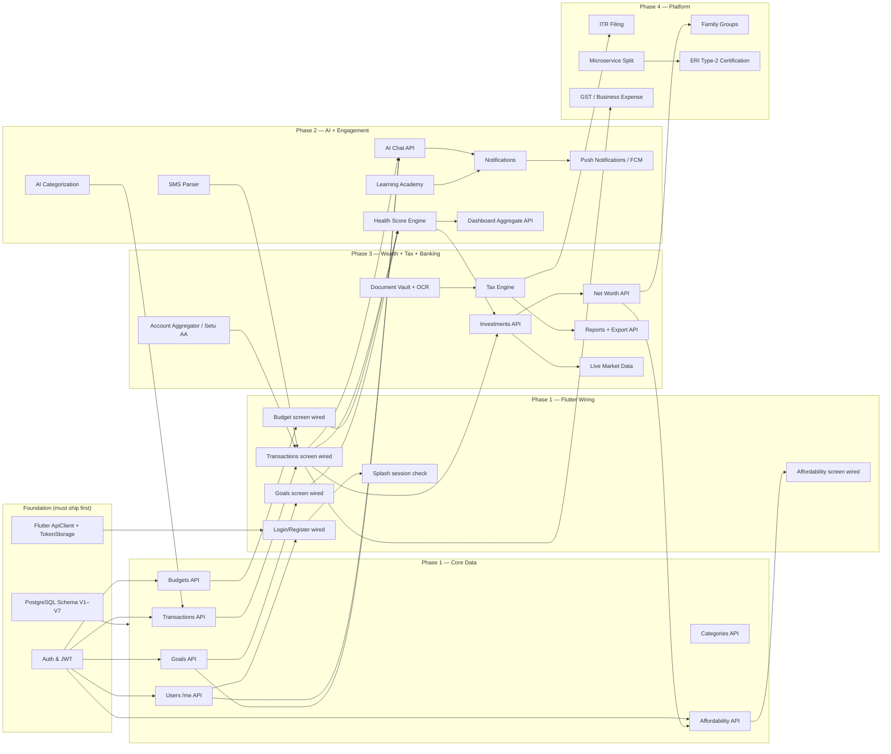

---

## 13. Microservice Migration Strategy

### Philosophy: Strangler Fig Pattern

The current Spring Boot monolith is not broken up all at once. Instead, new domains are built as separate services from the start (Phase 3+), and existing high-load domains are extracted when they show clear scaling or coupling pain. The monolith continues to serve until each extracted service has been in production for 30 days without regressions.

### Migration Sequence and Rationale

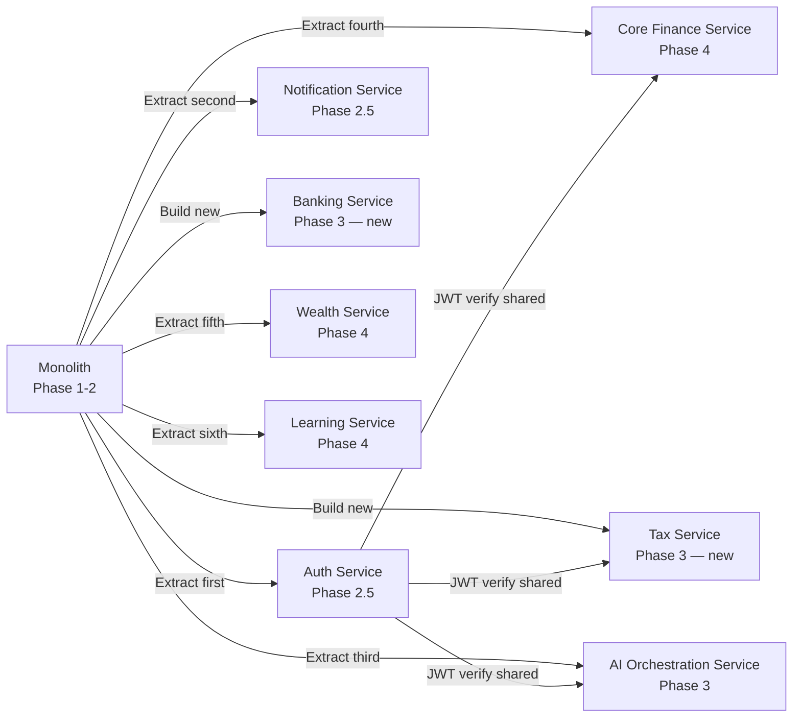

**Why Auth first:** Authentication is stateless (JWT), has no database dependencies on other domains, and is the highest-risk service to have in a shared JVM. Extracting it gives a clean token-verification library that every other service can use.

**Why Notification second:** Notifications are produced by every other domain (budget breach, AI insight, achievement) but consumed only by FCM/email. Extracting it early allows the monolith to publish to a message queue (Kafka topic `notification.requested`) without caring about delivery mechanics.

**Why Banking and Tax as new services:** These domains never existed in the monolith. Building them net-new as isolated services is simpler than retrofitting. They also require different SLAs (Banking is sensitive to third-party AA latency; Tax has seasonal load spikes during March–July).

**Why AI Orchestration as extraction:** The LangChain layer (Python preferred for tooling ecosystem) does not fit in the Java monolith cleanly. It is extracted or built new as a Python FastAPI service communicating via internal REST.

**Why Core Finance last:** This is the busiest domain (transactions, budgets, goals). Extracting it requires the most careful data migration and introduces the highest risk. By Phase 4, event sourcing patterns are mature enough to do this safely.

### Service Communication Standards

- **Synchronous (REST):** Used for user-facing request/response flows. Services communicate via internal ALB DNS names, not public hostnames.
- **Asynchronous (Kafka):** Used for domain events (TransactionCreated, BudgetBreached, GoalAchieved). Consumer services subscribe and process at their own pace.
- **Service-to-service auth:** mTLS for internal calls; each service has an IAM role scoped to its own S3 prefix, RDS schema, and Kafka topic.

---

## 14. Event-Driven Architecture

### Event Bus Design

In Phase 2, a lightweight event bus is implemented using **Redis Streams** (already deployed) — zero additional infrastructure, acceptable throughput for <10k DAU.

In Phase 3, when user base exceeds 50k DAU or when Banking Service introduces high-volume statement imports, migrate to **Amazon MSK (Kafka)** for durable, replayable event streams.

### Domain Event Catalog

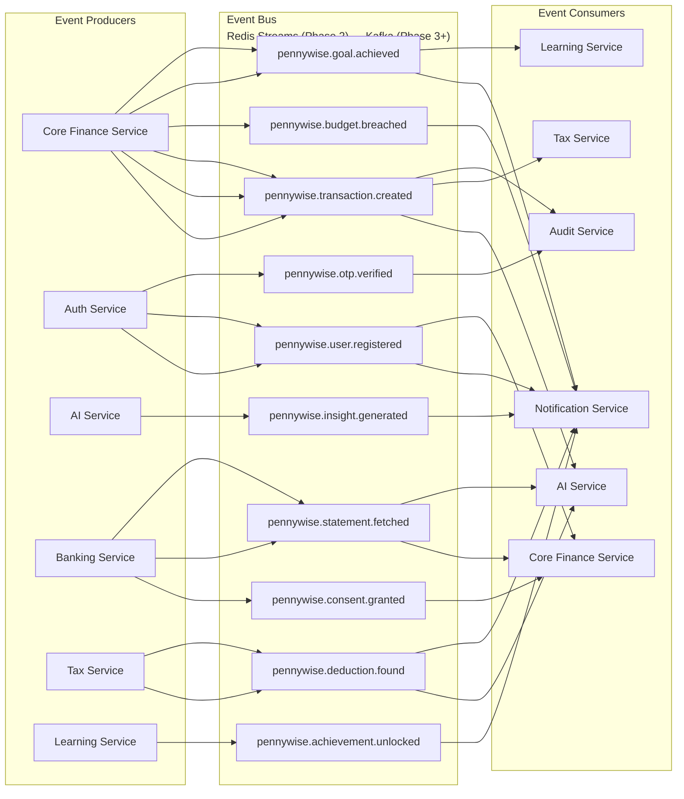

### Event Schema Standard

All events follow a consistent envelope:

```json
{
  "eventId": "uuid",
  "eventType": "pennywise.transaction.created",
  "version": "1.0",
  "producedAt": "2026-08-01T10:30:00Z",
  "userId": "uuid",
  "correlationId": "uuid",
  "payload": {
    "transactionId": "uuid",
    "amount": 1500.00,
    "direction": "DEBIT",
    "categoryId": "uuid",
    "source": "MANUAL"
  }
}
```

### Event Sourcing Consideration

Full event sourcing (storing state as a log of events, not rows) is not applied in Phase 1–3 — it adds significant operational complexity for limited benefit at current scale. The exception is the **Audit Log** table (`audit_log`, V18 migration), which is an append-only event store for DPDP compliance. In Phase 4, the **Tax Engine** may adopt event sourcing for ITR draft history (each amendment is a new event, not an update to a row).

### Redis Streams Implementation (Phase 2)

```java
// Producer — after TransactionService.create()
redisTemplate.opsForStream().add(
    StreamRecords.newRecord()
        .in("pennywise.transaction.created")
        .ofMap(Map.of(
            "eventId", UUID.randomUUID().toString(),
            "userId", userId.toString(),
            "transactionId", tx.getId().toString(),
            "amount", tx.getAmount().toString(),
            "direction", tx.getDirection().name()
        ))
);

// Consumer — NotificationService with @Scheduled polling or Redis XREADGROUP
```

---

## 15. Banking Integration Roadmap

### Account Aggregator (Setu AA) — Sequence Diagram

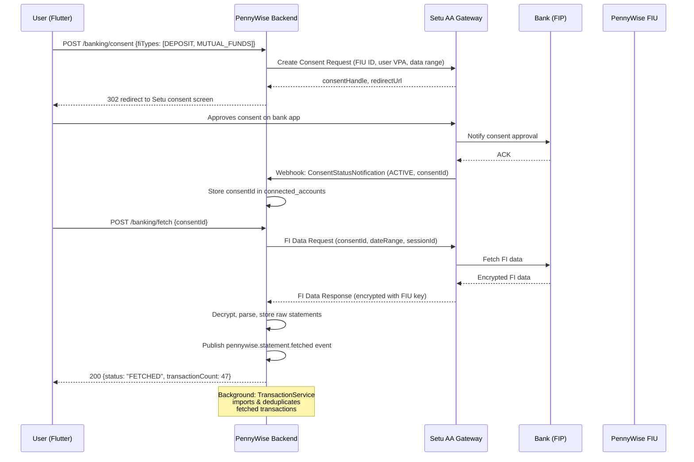

### Data Flow After Statement Fetch

1. Raw bank statement JSON is parsed into `TransactionCreateRequest` objects
2. Each transaction is checked against `sms_imports` table for deduplication (same amount, date, merchant within ±1 day window)
3. Surviving new transactions are batch-inserted into `transactions` with `source = BANK_STATEMENT`
4. `CategorizationEngine` runs async on each uncategorized transaction
5. Budget `spent_so_far` is recalculated for affected categories and periods
6. `pennywise.transaction.created` events are emitted for each imported transaction

### Perfios Integration (Phase 3.5)

Perfios provides bank statement PDF parsing and CIBIL-equivalent score analysis. Integration points:
- Upload scanned/downloaded bank statement PDF to Perfios API
- Receive structured JSON with transactions, categorization, and cash-flow analytics
- Map to our `TransactionDto` schema and import with `source = BANK_STATEMENT`
- Use Perfios income verification for premium feature gating (e.g., confirm salary range for investment recommendations)

### Digio Integration (eSign, eKYC)

Required for: ITR filing consent, loan applications, insurance policy updates.
- eKYC: Aadhaar OTP-based identity verification → store KYC status flag on `users` table
- eSign: Sign ITR verification form (ITR-V) digitally using Aadhaar-linked DSC
- Integration via Digio REST API; redirect flow similar to AA consent

### Consent Management Design (DPDP Compliance)

Every AA consent record must store:
- Purpose of data use (specific, not generic)
- Data types requested (DEPOSIT, MUTUAL_FUNDS, INSURANCE, etc.)
- Date range of data access
- Expiry date of consent
- User's right to revoke (DELETE /banking/consent/{consentId})

Consent revocation triggers:
1. DELETE from `connected_accounts`
2. Delete all transactions sourced from that account (`source = BANK_STATEMENT` + `account_id`)
3. Emit `pennywise.consent.revoked` event for audit log

---

## 16. Tax Platform Roadmap

### Tax Engine Design

```mermaid
graph TB
    subgraph Input["Data Inputs"]
        TXN_DATA[Transactions with tax_category flags]
        FORM16[Form 16 (employer TDS certificate)]
        AIS_DATA[AIS — Annual Information Statement]
        F26AS[Form 26AS (TDS credits)]
        INVEST_DATA[Investment portfolio (80C, ELSS)]
        INSURE[Insurance premiums (80D)]
    end

    subgraph Engine["Tax Engine"]
        INCOME_CALC[Gross Income Calculator]
        DEDUCTION_FINDER[Deduction Finder<br/>80C, 80D, 80E, HRA, LTA, NPS]
        REGIME_COMP[Old vs New Regime Comparator]
        TAX_CALC[Tax Calculator<br/>slab-based, with cess]
        ADV_TAX[Advance Tax Scheduler<br/>quarterly due dates]
        ITR_GEN[ITR Form Generator<br/>ITR-1 / ITR-2 JSON]
    end

    subgraph Output["Outputs"]
        TAX_SUMMARY[Tax Summary Dashboard]
        DEDUCTION_TIPS[AI Deduction Tips]
        ADVANCE_NOTIF[Advance Tax Notifications]
        ITR_DRAFT[ITR Draft for Filing]
    end

    Input --> Engine
    INCOME_CALC --> REGIME_COMP
    DEDUCTION_FINDER --> REGIME_COMP
    REGIME_COMP --> TAX_CALC
    TAX_CALC --> ADV_TAX
    TAX_CALC --> ITR_GEN
    Engine --> Output
```

### ITR Filing Sequence

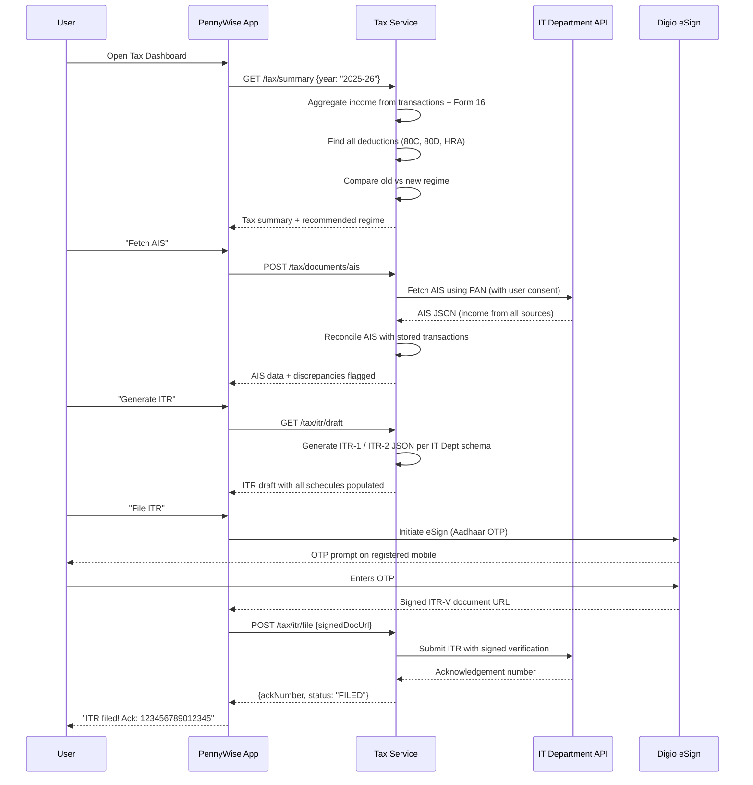

### Tax Calendar (Advance Tax Due Dates)

| Quarter | Due Date | Percentage of Annual Tax |
|---------|----------|--------------------------|
| Q1 | June 15 | 15% |
| Q2 | September 15 | 45% cumulative |
| Q3 | December 15 | 75% cumulative |
| Q4 | March 15 | 100% |

The Tax Engine calculates projected annual tax in May and sends advance tax reminders via Notification Service 14 days before each due date.

---

## 17. Security and Compliance Architecture

### OWASP Top 10 Mitigations

| Risk | Mitigation | Status |
|------|-----------|--------|
| A01 Broken Access Control | JWT auth on all endpoints; `CurrentUserProvider` enforces resource ownership on every query (`WHERE user_id = :userId`) | Implemented |
| A02 Cryptographic Failures | BCrypt for passwords; HMAC-SHA256 JWT; AES-256 for PAN/account numbers (Phase 2); TLS 1.3 in transit | Partial — PAN encryption Phase 2 |
| A03 Injection | Spring Data JPA parameterized queries; no raw SQL string concatenation | Implemented |
| A04 Insecure Design | AffordabilityEngine uses explicit, auditable rules; no black-box decisions that bypass business rules | Implemented |
| A05 Security Misconfiguration | CORS must be locked to known origins before production; actuator endpoints must be on internal port only | Open issue |
| A06 Vulnerable Components | Dependabot enabled; Flyway migrations reviewed; JJWT 0.12.6 (current, no known CVEs) | Implemented |
| A07 Identity Failures | OTP rate-limited (5 attempts, Redis TTL); JWT refresh rotation on every use; 1h access token TTL | Implemented |
| A08 Software Integrity | GitHub Actions CI signs artifacts; Docker images pinned by digest | Phase 2 |
| A09 Logging Failures | Structured JSON logs planned; current logs are plaintext INFO/DEBUG only | Open issue |
| A10 SSRF | All external HTTP calls (OpenAI, Fast2SMS) use explicit URL constants; no user-supplied URLs in server-side requests | Implemented |

### JWT Security Details

- Algorithm: HMAC-SHA256 (HS256) via JJWT 0.12.6
- Secret: minimum 256-bit, sourced from env var `JWT_SECRET`; never hardcoded
- Access token TTL: 1 hour (`access-token-expiry-ms: 3600000`)
- Refresh token TTL: 30 days (`refresh-token-expiry-ms: 2592000000`)
- Token type claim: `"type": "access"` or `"type": "refresh"` — prevents refresh token replay as access token
- Rotation: every `/auth/refresh` call issues a new refresh token (sliding window)
- Storage on device: `flutter_secure_storage` → iOS Keychain, Android Keystore with `encryptedSharedPreferences: true`

### DPDP Act (Digital Personal Data Protection Act) Compliance

| Requirement | Implementation |
|-------------|----------------|
| Lawful purpose | Every data collection has a documented purpose in the consent flow |
| Explicit consent | AA consent screen, OTP-based identity verification for PAN linkage |
| Data minimization | PAN collected only when Tax Module is activated; Aadhaar number never stored |
| Right to access | `GET /users/me` returns all profile data; `GET /data-export` (Phase 3) returns full dump |
| Right to erasure | `DELETE /account` cascades deletes all user data including chat history, documents, transactions |
| Data retention | Chat history: 90 days. Transaction data: 7 years (IT Act requirement). Documents: 7 years. |
| Breach notification | Incident response runbook; 72-hour notification to CERT-In + affected users |
| Data Fiduciary registration | Required before processing data of >5k users — file registration before M2 |

### ERI Type-2 Requirements (Electronic Return Intermediary)

Required for ITR filing flow (Phase 3/4). Key requirements:
- Must be a registered company (not a sole proprietorship)
- Application to CBDT with CA certificate, cybersecurity audit report, and infrastructure details
- Annual renewal; VAPT (Vulnerability Assessment and Penetration Testing) mandatory
- User data must be stored on servers physically located in India
- Data must not be shared with third parties without explicit user consent

### VAPT Scope (Pre-ERI Application)

- API layer: all REST endpoints, JWT handling, CORS
- Mobile app: certificate pinning, local storage audit, deep link handling
- Infrastructure: network segmentation, S3 bucket policies, RDS security groups
- Reporting: findings remediated to severity Critical (P0) and High (P1) before application

### Data Encryption Strategy

| Data Category | At Rest | In Transit |
|---------------|---------|------------|
| Passwords | BCrypt hash (cost 12) | TLS 1.3 |
| JWT tokens | Stored in OS Keychain/Keystore | TLS 1.3 |
| PAN | AES-256 column encryption (Phase 2) | TLS 1.3 |
| Bank account numbers | AES-256 column encryption (Phase 3) | TLS 1.3 |
| Transactions, budgets, goals | PostgreSQL at-rest encryption (RDS storage encryption on AWS) | TLS 1.3 |
| Documents (receipts, Form 16) | S3 SSE-KMS | TLS 1.3 (pre-signed URLs) |
| Chat history | PostgreSQL at-rest encryption | TLS 1.3 |

---

## 18. DevOps and Infrastructure

### Current Setup → Target AWS Architecture

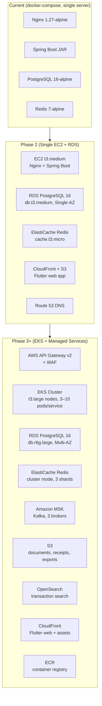

### CI/CD Pipeline

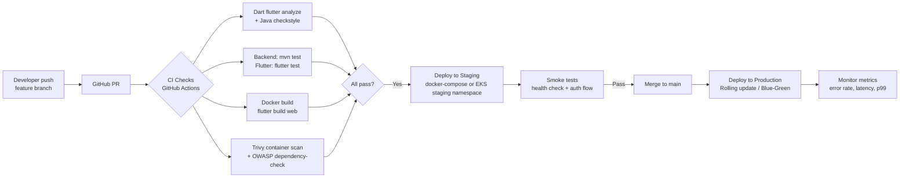

### Environment Strategy

| Environment | Infrastructure | Purpose | Refresh |
|-------------|---------------|---------|---------|
| Local | docker-compose (4 services) | Development, daily coding | Dev machine |
| Staging | Single EC2 or EKS dev namespace | Integration testing, QA, PM demos | On every merge to `main` |
| Production | EKS (Phase 3+) or EC2 (Phase 2) | Live users | Controlled releases |

### Container Strategy

- Backend: `eclipse-temurin:21-jre-alpine` base image (slim JRE, not full JDK)
- All images pinned by digest in CI to prevent supply-chain attacks
- Images tagged as `pennywise-backend:sha-<commit-hash>` — no `latest` tag in production
- Health check: `GET /api/actuator/health` — must return 200 before pod receives traffic

### Secrets Management

- Phase 2: AWS Secrets Manager; injected as environment variables at container startup
- Phase 3: AWS Secrets Manager + External Secrets Operator (ESO) for Kubernetes
- Never store secrets in `.env` files committed to git; `.env.example` has placeholder values only
- JWT_SECRET rotated quarterly; rotation triggers rolling restart of all backend pods

---

## 19. Testing Strategy

### Testing Pyramid

```
         ┌────────────────┐
         │  E2E Tests     │  ← Few, slow, high-value user flows
         │  (Maestro /    │     Login → Add transaction → View dashboard
         │   Playwright)  │
        ┌┴────────────────┴┐
        │ Integration Tests │  ← Spring Boot @SpringBootTest
        │ Widget Tests      │     API → DB → Response verified
        │ (Flutter)         │     Flutter screens render + tap correctly
       ┌┴──────────────────┴┐
       │    Unit Tests       │  ← Fast, pure logic, no I/O
       │    (JUnit 5, Dart)  │     AffordabilityEngine, HealthScoreService,
       │                     │     JWT parsing, currency formatters
       └─────────────────────┘
```

### Backend — Spring Boot Testing

**Unit Tests (JUnit 5 + Mockito)**
- Target: service classes, engine classes, utility functions
- All service methods that contain business logic must have unit tests
- Mock: `Repository`, `CurrentUserProvider`, external HTTP clients
- Coverage target: ≥ 90% for `ai/` and `service/` packages

```java
// Example: AffordabilityEngine unit test structure
@Test
void whenMonthlySurplusZero_shouldReturnDontBuy() {
    var result = engine.evaluate(request, INCOME_30K, EXPENSES_35K, EMERGENCY_60K);
    assertThat(result.getVerdict()).isEqualTo("DONT_BUY");
}

@Test
void whenEmergencyFundDropsBelowFloor_shouldReturnWaitAndSave() {
    var result = engine.evaluate(request, INCOME_50K, EXPENSES_30K, EMERGENCY_10K);
    assertThat(result.getVerdict()).isEqualTo("WAIT_AND_SAVE");
    assertThat(result.getRecommendedWaitMonths()).isGreaterThan(0);
}
```

**Integration Tests (@SpringBootTest + Testcontainers)**
- Target: all REST controller → service → repository → database flows
- Use Testcontainers PostgreSQL and Redis — no mocking of the database layer
- Test auth filter: assert 401 on missing token, 200 on valid token
- Test data isolation: each test runs in a transaction rolled back after completion

**Contract Tests (Spring Cloud Contract)**
- Phase 3: when services split, produce consumer-driven contracts
- Backend publishes contract stubs; Flutter/mobile team tests against stubs in CI

### Flutter — Dart Testing

**Unit Tests**
- Target: `AuthRepository._isTokenExpired()`, `currency_formatter.dart`, `validators.dart`
- Target: any Dart class with pure business logic
- Coverage target: ≥ 80% for `data/` and `core/utils/` packages

**Widget Tests**
- Target: `LoginScreen` renders email + password fields; tap login calls `AuthRepository.login()`
- Mock: `ApiClient` via `mockito` package
- Do not test widget tree structure — test user-visible behavior (text, button presses, navigation)

**Integration Tests (flutter_test with real device)**
- Target: splash → login → dashboard flow
- Run on CI against a live staging backend
- Use Maestro (mobile E2E framework) for critical flows: onboarding, add transaction, view health score

### Test Coverage Targets

| Layer | Target | Priority |
|-------|--------|----------|
| AI engines (AffordabilityEngine, HealthScoreService) | 90% | Critical |
| Service layer (TransactionService, AuthService, etc.) | 80% | High |
| Repository layer | 60% (integration tests) | Medium |
| Controller layer | 70% (integration tests) | Medium |
| Flutter data layer (repositories) | 75% | High |
| Flutter UI (widget tests) | 50% (critical screens) | Medium |

---

## 20. Monitoring and Observability

### Metrics (Micrometer + Prometheus + Grafana)

Spring Boot Actuator exposes Micrometer metrics at `/actuator/prometheus`. Key metrics to track:

| Metric | Alert Threshold | Dashboard |
|--------|----------------|-----------|
| `http.server.requests` p99 latency | > 2000ms | API Latency |
| `http.server.requests` error rate | > 1% | Error Rate |
| `jvm.memory.used` heap | > 80% of max | JVM Health |
| `db.pool.pending.connections` | > 5 | DB Pool |
| `ai.chat.latency` (custom) | > 5000ms | AI Performance |
| `transactions.created.count` (custom) | — | Business Volume |
| `otp.send.failures` (custom) | > 10/hour | Auth Health |

### Logs (Structured JSON, ELK Stack Phase 3)

Current log format is plaintext. Phase 2 migration:
```yaml
# application-prod.yml
logging:
  pattern:
    console: '{"ts":"%d{ISO8601}","level":"%p","logger":"%c{1}","msg":"%m","traceId":"%X{traceId}"}%n'
```

Log fields standardized across all services:
- `traceId` (from OpenTelemetry context, Phase 3)
- `userId` (from JWT, where applicable)
- `duration_ms` (for all external calls: DB, Redis, OpenAI, Fast2SMS)
- `endpoint` and `http_status` for all API requests

Never log: raw JWT tokens, passwords, PAN, bank account numbers, OTP codes.

### Distributed Tracing (OpenTelemetry + Jaeger, Phase 3)

```xml
<!-- backend pom.xml addition -->
<dependency>
  <groupId>io.opentelemetry.instrumentation</groupId>
  <artifactId>opentelemetry-spring-boot-starter</artifactId>
</dependency>
```

Every request gets a `traceId` propagated through:
- HTTP headers (`traceparent`, W3C format)
- Redis calls
- PostgreSQL queries (via JDBC instrumentation)
- OpenAI calls (manual span around `RestTemplate.postForObject()`)

Trace data exported to Jaeger (self-hosted) or AWS X-Ray.

### SLA / SLO Definitions

| Service | SLO | Measurement Window |
|---------|-----|-------------------|
| API availability | 99.5% | 30-day rolling |
| API p99 latency | < 1500ms | 30-day rolling |
| AI chat response | < 8000ms (p95) | 30-day rolling |
| Dashboard load | < 3000ms (p95) | 30-day rolling |
| OTP delivery | < 30s (p90) | 7-day rolling |

Error Budget: 99.5% availability over 30 days = 3.6 hours downtime budget. When budget < 25% remaining, freeze non-critical deployments and focus on reliability.

### Alerting

Phase 2 (simple): UptimeRobot pings `GET /api/actuator/health` every 5 minutes. PagerDuty alert on failure.

Phase 3 (comprehensive): Prometheus Alertmanager → PagerDuty / Slack:
- P0 (page): API error rate > 5% for 5 minutes; health check failure; DB connection pool exhausted
- P1 (Slack notify): AI chat latency > 8s for 10 minutes; OTP delivery failure rate > 20%
- P2 (daily digest): Disk usage > 70%; memory > 85%

---

## 21. Disaster Recovery and Backup

### RTO and RPO Targets

| Scenario | RTO (Recovery Time Objective) | RPO (Recovery Point Objective) |
|---------|-------------------------------|-------------------------------|
| Single pod crash (EKS) | < 60 seconds | 0 (stateless pod) |
| Database primary failure (RDS Multi-AZ failover) | < 2 minutes | < 30 seconds |
| Full region outage (Phase 4) | < 4 hours | < 15 minutes |
| Accidental data deletion | < 1 hour | < 24 hours |
| Ransomware / data corruption | < 8 hours | < 24 hours |

### Database Backup Strategy

| Phase | Backup Method | Retention | Verification |
|-------|-------------|-----------|-------------|
| Phase 2 (RDS Single-AZ) | Automated RDS daily snapshots | 7 days | Monthly restore drill |
| Phase 3 (RDS Multi-AZ) | Automated snapshots + PITR enabled | 35 days | Quarterly restore drill |
| Phase 4 | PITR + cross-region snapshot copy | 35 days (primary), 7 days (replica region) | Monthly drill |

Point-in-Time Recovery (PITR): With 5-minute transaction log archive intervals, RPO is 5 minutes. This covers the "accidental bulk delete" scenario.

### Multi-Region Consideration (Phase 4)

Primary region: `ap-south-1` (Mumbai) — closest to Indian users, satisfies DPDP data residency requirement.

Disaster recovery region: `ap-southeast-1` (Singapore) — cross-region RDS snapshot replication at 15-minute intervals. Route 53 health check → failover record → redirect traffic if primary is unhealthy for > 3 minutes.

### Runbooks

Every P0 alert has a runbook in `/docs/runbooks/`:
- `DB_CONNECTION_EXHAUSTED.md` — steps to identify slow queries, kill blocking connections, increase pool size
- `BACKEND_OOM.md` — heap dump, identify memory leak, rolling restart
- `REDIS_DOWN.md` — check ElastiCache, restart OTP flow in dev mode (return OTP in response body)
- `OPENAI_API_DOWN.md` — AI chat returns cached last insight; affordability falls back to rule-only mode

---

## 22. Cost Optimization Strategy

### AWS Cost Breakdown by Phase

| Component | Phase 2 (Monthly) | Phase 3 (Monthly) | Phase 4 (Monthly) |
|-----------|------------------|------------------|------------------|
| EC2 / EKS compute | $35 (t3.medium) | $300 (EKS, 6 t3.large nodes) | $1,200 (EKS, mixed m6i.xlarge) |
| RDS PostgreSQL | $30 (db.t3.medium) | $200 (db.r6g.large Multi-AZ) | $600 (db.r6g.xlarge Multi-AZ) |
| ElastiCache Redis | $15 (cache.t3.micro) | $80 (cluster, 3 × cache.m6g.large) | $250 (cluster, scaled) |
| Amazon MSK (Kafka) | — | $150 (3 × kafka.m5.large) | $300 |
| S3 (documents) | $5 | $30 | $150 |
| CloudFront CDN | $5 | $20 | $80 |
| API Gateway | $5 | $30 | $150 |
| OpenSearch | — | $100 | $300 |
| OpenAI API (AI chat) | $20 | $200 | $800 |
| Fast2SMS OTP | $10 | $50 | $200 |
| Monitoring (Grafana Cloud) | $0 (free tier) | $50 | $150 |
| **Total** | **~$125/month** | **~$1,210/month** | **~$4,180/month** |

### Cost Per User Target

| Phase | MAU Target | Cost/MAU | Acceptable? |
|-------|-----------|---------|-------------|
| Phase 2 | 5,000 | $0.025 | Yes |
| Phase 3 | 50,000 | $0.024 | Yes |
| Phase 4 | 200,000 | $0.021 | Yes — target < $0.05 |

### Caching Strategy

- **Redis L1 cache (TTL 5 minutes):** Dashboard aggregate data, health score, latest AI insights — avoid recomputing on every page load
- **Redis L2 cache (TTL 1 hour):** Category list (changes rarely), default savings rules, market data NAV
- **Client-side cache (DashboardCache.dart):** Dashboard data cached in memory for 5 minutes — prevents redundant API calls on tab switches
- **CDN cache (CloudFront TTL 1 day):** Flutter web app static assets, Lottie animations, app icons

### Database Query Optimization

Key indexes already in schema:
- `idx_transactions_user_date (user_id, transaction_date DESC)` — primary list query
- `idx_budgets_user_period (user_id, period)` — budget retrieval
- `idx_notifications_user_unread (user_id, read)` — notification badge count

Phase 2 additions:
- Partial index on `transactions (user_id, transaction_date)` WHERE `direction = 'DEBIT'` — for spending calculations
- Index on `learning_progress (user_id, completed)` — for gamification leaderboard

### Auto-Scaling Policies (Phase 3, EKS)

- **Backend pods:** HPA (Horizontal Pod Autoscaler) — scale out when CPU > 60% or request rate > 500 RPS per pod; scale in when CPU < 30% for 5 minutes
- **AI service pods:** Scale on custom metric `ai.queue.depth` — if pending AI requests > 10, add pods; AI service is stateless and safe to scale
- **Database:** RDS does not auto-scale vertically — monitor `FreeableMemory` and `CPUUtilization`; upgrade instance class during scheduled maintenance window
- **Redis:** ElastiCache cluster mode shards scale horizontally — add shards when `CacheMisses` exceeds 5% hit rate

---

## 23. Release Strategy

### Feature Flags

Phase 2 implements a lightweight feature flag system backed by Redis:

```java
// FeatureFlagService
public boolean isEnabled(String flag, UUID userId) {
    // Check: global enable in Redis hash "feature_flags"
    // Check: user-level override in Redis hash "feature_flags:user:{userId}"
    // Check: rollout percentage stored in "feature_flags:rollout:{flag}"
    // Deterministic hash(userId + flag) % 100 < rolloutPct
}
```

Flags in use at launch:
- `AI_CHAT_ENABLED` — global toggle for AI chat (off = show "Coming soon" screen)
- `SMS_IMPORT_ENABLED` — toggle SMS parser feature
- `AA_BANKING_ENABLED` — Account Aggregator flow (off until Setu integration certified)
- `TAX_MODULE_ENABLED` — Tax dashboard (off until Phase 3)
- `LEADERBOARD_ENABLED` — opt-in gamification

Phase 3: Migrate to LaunchDarkly for targeting by user_type, income bracket, and A/B experiment groups.

### Deployment Process

**Phase 2 (EC2, rolling restart):**
```bash
# CI builds image, pushes to ECR
# Deploy script on server:
docker pull ecr.amazonaws.com/pennywise-backend:sha-${COMMIT}
docker-compose up -d --no-deps backend
# Wait for health check:
until curl -sf http://localhost:8080/api/actuator/health; do sleep 2; done
```

**Phase 3 (EKS rolling update):**
```yaml
# Kubernetes Deployment strategy
strategy:
  type: RollingUpdate
  rollingUpdate:
    maxSurge: 1
    maxUnavailable: 0
```
New pods must pass health check before old pods are terminated — zero-downtime deployment.

### App Store Release Process

**iOS (App Store):**
1. Increment version in `pubspec.yaml` and iOS `Info.plist`
2. `flutter build ipa --release --export-options-plist ExportOptions.plist`
3. Upload to App Store Connect via `xcrun altool` or Transporter
4. Submit for review (allow 1–3 business days)
5. Enable Phased Release (7-day rollout): 1% → 2% → 5% → 10% → 20% → 50% → 100%

**Android (Play Store):**
1. `flutter build appbundle --release`
2. Upload to Play Console
3. Release to Internal Testing → Closed Testing (beta users) → Production
4. Play Store supports staged rollout: start at 10%, monitor ANR/crash rate, scale to 100%

### Hotfix Process

Critical production bugs (P0 severity) bypass normal sprint cycle:
1. Branch from the current production tag: `git checkout -b hotfix/P0-jwt-expiry v1.2.3`
2. Fix is implemented and reviewed by at least one other engineer
3. Fast-tracked CI (only security scan + critical test subset)
4. Deploy to staging, smoke test, deploy to production
5. Merge hotfix branch back to `main` immediately
6. Post-mortem within 48 hours documenting root cause and prevention

---

## 24. Engineering Standards

### Code Review Process

- Every change requires at least one approving review before merge (solo founder phase: self-review with 24-hour delay to catch obvious mistakes)
- PR description must include: what changed, why, how to test, any migration steps
- Reviewer checks: correctness, security (does this expose data of other users?), test coverage, API backward compatibility
- CI must be green before merge — no exceptions
- Draft PRs are encouraged for early feedback; mark `[WIP]` in title

### PR Size Limits

| Type | Guideline |
|------|-----------|
| Feature | < 400 lines changed (excluding tests and migrations) |
| Bug fix | < 150 lines |
| Refactor | < 200 lines |
| Migration | Single Flyway file per PR; reviewed for reversibility |

Large PRs are split into: (a) schema migration, (b) backend logic, (c) frontend wiring — merged in sequence.

### Definition of Done

A feature is "done" when all of the following are true:
- [ ] Backend endpoint implemented and tested (unit + integration)
- [ ] Flutter screen wired to the backend (no mock data in shipped code)
- [ ] Error states handled (network failure, 401, 404, 422 validation errors)
- [ ] Empty state handled (first-time user, no data)
- [ ] Loading state shown (skeleton or progress indicator)
- [ ] Monitoring: custom metric or log event for the critical path
- [ ] Flyway migration reviewed and merged (if schema change)
- [ ] CLAUDE.md updated if a new screen/endpoint is added

### On-Call Rotation (Phase 3+)

- Solo founder phase (current): founder is on-call; PagerDuty quiet hours 11PM–7AM IST unless P0
- Phase 3 (3–5 engineers): weekly rotation; primary + secondary on-call; 15-minute SLA to acknowledge P0
- Runbook for every P0 alert is mandatory before rotation coverage is expected

---

## 25. Coding Guidelines

### Dart / Flutter

**Style:**
- Follow `flutter_lints` rules as enforced by `flutter analyze`
- `withOpacity()` is deprecated in Flutter 3.44 — use `.withValues(alpha: x)` (56 existing lint warnings to fix)
- Prefer `const` constructors everywhere possible
- `StatefulWidget` is acceptable for simple local UI state (loading, form fields). For state shared across screens or persisted after navigation, use `flutter_bloc` (BLoC is declared in pubspec, not yet wired)

**Naming:**
- Files: `snake_case.dart`
- Classes: `PascalCase`
- Variables and methods: `camelCase`
- Constants: `camelCase` (Dart convention, not `SCREAMING_SNAKE_CASE`)
- Private members: `_prefixedWithUnderscore`

**Anti-patterns to avoid:**
- Do not call `context.go()` inside `initState()` — causes routing assertion errors; use `WidgetsBinding.instance.addPostFrameCallback()`
- Do not store sensitive data (tokens, PAN) in `SharedPreferences` — use `TokenStorage` (flutter_secure_storage)
- Do not hardcode API URLs — use `ApiConstants.baseUrl`; it resolves differently for web, iOS, and Android
- Do not catch and swallow all exceptions with empty `catch (_) {}` — log the error at minimum

**Async patterns:**
- Prefer `async/await` over raw `.then().catchError()`
- Use `mounted` check before `setState()` after any async gap
- `AppServices.instance.someRepo.method().then(...).catchError(...)` pattern (used in dashboard) is acceptable for fire-and-forget; use `await` when the result drives UI

### Java / Spring Boot

**Style:**
- Google Java Format (enforced by Checkstyle in CI)
- One class per file, named identically to the file
- Package-private where possible; only expose `public` what other packages genuinely need

**Naming:**
- Packages: lowercase, singular nouns (`entity`, `service`, `controller`, not `entities`)
- Classes: `PascalCase`; DTOs end in `Dto`, requests in `Request`, responses in `Response`
- Methods: `camelCase`, verb-first (`createTransaction`, `findByUserId`, `calculate`)
- Constants: `SCREAMING_SNAKE_CASE`

**Spring-specific:**
- Use constructor injection exclusively — no `@Autowired` on fields (hard to test)
- Services are `@Transactional` only at the method level, not class level
- Never expose JPA entities directly in API responses — always map to DTOs in the service layer
- `CurrentUserProvider.get()` is the single authoritative way to get the authenticated user — never read `SecurityContextHolder` directly in controllers or services

**Anti-patterns to avoid:**
- N+1 queries: use `@ManyToOne(fetch = FetchType.LAZY)` (default) and join-fetch in JPQL only when necessary
- Do not use `Optional.get()` without `isPresent()` — always use `orElseThrow()`
- Do not use `String.format()` for SQL — parameterize via Spring Data JPQL
- Do not catch `Exception` generically in services — let `GlobalExceptionHandler` translate exceptions to HTTP responses

### SQL / Database

- Table names: `snake_case`, plural nouns (`users`, `transactions`, `learning_progress`)
- Column names: `snake_case`
- Every table has `id UUID PRIMARY KEY DEFAULT gen_random_uuid()`, `created_at TIMESTAMPTZ DEFAULT now()`, `updated_at TIMESTAMPTZ DEFAULT now()`
- UUIDs everywhere — never integer auto-increment IDs (exposes row count, enables enumeration attacks)
- Flyway migration files: `V{N}__{snake_case_description}.sql` — two underscores after version number
- Migrations are append-only: never modify or delete a committed migration file
- Soft deletes: for user-visible data (transactions, goals), prefer `deleted_at TIMESTAMPTZ` over hard deletes. Hard deletes only on cascaded data or compliance-driven erasure.

---

## 26. API Standards

### REST Conventions

| Pattern | Standard |
|---------|----------|
| Resource naming | Plural nouns: `/transactions`, `/goals`, `/budgets` |
| Sub-resources | `/goals/{id}/saved-amount` (not `/updateGoalSavedAmount`) |
| Query parameters | Filter: `?category=food&direction=DEBIT`; pagination: `?page=0&size=20` |
| HTTP methods | GET (read), POST (create), PUT (full replace), PATCH (partial update), DELETE (remove) |
| Status codes | 200 (OK), 201 (Created), 204 (No Content), 400 (Bad Request), 401 (Unauthorized), 403 (Forbidden), 404 (Not Found), 409 (Conflict), 422 (Unprocessable), 500 (Server Error) |

### Pagination Standard

All list endpoints support cursor-based pagination (Phase 3) or page-based (current):

```
GET /transactions?page=0&size=20&sort=transactionDate,desc
```

Response always includes `meta` with `total`, `page`, `pageSize`, `hasNext`.

Maximum `size` is capped at 100 to prevent bulk data extraction.

### Error Response Standard

The `GlobalExceptionHandler` produces consistent error bodies:
```json
{
  "timestamp": "2026-08-01T10:30:00.000Z",
  "status": 422,
  "error": "Unprocessable Entity",
  "message": "Validation failed",
  "path": "/api/transactions",
  "fieldErrors": {
    "amount": "must be greater than 0",
    "direction": "must be one of: DEBIT, CREDIT"
  }
}
```

### Rate Limiting

Phase 2: Redis token bucket per user:
- Standard endpoints: 100 requests/minute per user
- AI chat: 20 requests/day per user (free tier); 100/day (premium)
- Auth endpoints (`/auth/*`): 10 requests/minute per IP

Rate limit headers returned:
```
X-RateLimit-Limit: 100
X-RateLimit-Remaining: 94
X-RateLimit-Reset: 1754025600
```

### API Versioning

- Current: `/api/{endpoint}` — no version prefix (single client, private API)
- Phase 2 onwards: `/api/v1/{endpoint}`
- Version negotiation via URL path (not `Accept` header) — simpler for mobile clients
- `Sunset: Sat, 01 Aug 2027 00:00:00 GMT` header on deprecated v1 endpoints
- Changelog in `docs/API-CHANGELOG.md`

---

## 27. Database Standards

### Naming Conventions

| Object | Convention | Example |
|--------|-----------|---------|
| Tables | `snake_case`, plural | `learning_progress`, `chat_history` |
| Columns | `snake_case` | `monthly_income`, `transaction_date` |
| Indexes | `idx_{table}_{columns}` | `idx_transactions_user_date` |
| Foreign keys | `fk_{table}_{referenced_table}` | `fk_transactions_users` |
| Constraints | `uq_{table}_{columns}` | `uq_budgets_user_category_period` |
| Sequences | Avoided — use `gen_random_uuid()` |  |

### Migration Standards (Flyway)

- File pattern: `V{N}__{description}.sql` (two underscores; N is monotonically increasing)
- Migrations must be idempotent where possible: use `CREATE TABLE IF NOT EXISTS`, `CREATE INDEX IF NOT EXISTS`
- Never modify or delete committed migration files — Flyway checksums will fail
- For rollback: write a new migration `V{N+1}__rollback_{description}.sql` that reverses the change
- Include a comment block at the top of each migration explaining what it does and why
- Test migrations against a copy of production data before merging

### Soft Delete Standard

Tables with user-visible deletable data (transactions, goals, budgets) use soft delete:
```sql
ALTER TABLE transactions ADD COLUMN deleted_at TIMESTAMPTZ;
CREATE INDEX idx_transactions_active ON transactions(user_id, transaction_date)
  WHERE deleted_at IS NULL;
```

All queries filter `WHERE deleted_at IS NULL`. The `DELETE /transactions/{id}` endpoint sets `deleted_at = now()`, not SQL `DELETE`.

Hard deletes are only used for:
1. DPDP `DELETE /account` — cascaded hard delete of all user data
2. AA consent revocation — hard delete of bank-sourced transactions per revoked account

### Index Strategy

- Primary key indexes: automatic (UUID PK on every table)
- Every foreign key column gets an index (PostgreSQL does not add these automatically)
- Composite indexes ordered by selectivity (most selective column first)
- Partial indexes for common filtered queries (e.g., `WHERE deleted_at IS NULL`)
- Monitor `pg_stat_user_indexes` — remove indexes with `idx_scan = 0` after 30 days

### Audit Columns

Every table includes `created_at` and `updated_at`. JPA `BaseEntity` class manages these via `@CreatedDate` and `@LastModifiedDate` (Spring Data JPA Auditing, configured in `JpaAuditingConfig`).

For compliance-sensitive actions (login, profile update, data export), write to `audit_log` table separately from the entity update.

---

## 28. Future AI Agent Organization

### Agent Versioning

Each agent is versioned independently using semantic versioning of its prompt template:
- `coach-agent:v1.0` → initial release
- `coach-agent:v1.1` → improved spending category detection
- `coach-agent:v2.0` → breaking change: output schema changed (action_buttons added)

Agent versions are stored in the `ai_evaluation_log` table's `agent_type` field so regressions can be detected across versions.

### Agent Evaluation Framework

Every agent response is evaluated on three dimensions:

| Dimension | Method | Target |
|-----------|--------|--------|
| Relevance | LLM-as-judge: does the response address the user's question? | > 90% relevant |
| Grounding | Are all ₹ figures present in the financial context? | > 95% grounded |
| Tone | Is the response encouraging (not alarming) for borderline finances? | > 85% appropriate |
| Guardrails | Does the response contain prohibited content (stock tips, Aadhaar numbers)? | 0% violations |

Evaluation runs nightly on a sample of 100 random production interactions using a separate evaluation LLM call (GPT-4o judge prompt). Results stored in `ai_evaluation_log`. Alerts fire if relevance drops below 80% or guardrail violations > 0.

### Human-in-the-Loop Design

Three escalation paths from AI to human review:

1. **User feedback:** Thumbs up/down on AI chat responses. Two consecutive thumbs-down in one session triggers a human review queue item.
2. **Confidence threshold:** When AffordabilityEngine is extended with an LLM explanation layer, if the LLM's confidence in the explanation is < 0.7, the response includes "A human CA can verify this" disclaimer.
3. **Regulatory escalation:** Any response touching ITR filing, SEBI-regulated products, or insurance advice appends: "This is for informational purposes only. Please verify with a SEBI-registered advisor or CA before acting."

### Agent Improvement Cycle

```
Monthly:
1. Pull ai_evaluation_log — sample 500 interactions
2. Review bottom 10% by relevance score
3. Identify failure patterns (wrong intent routing, stale market data, unclear explanations)
4. Update prompt template or add few-shot examples
5. A/B test new version (50% traffic) for 2 weeks
6. Roll out if metrics improve, roll back if degraded
```

### Context Privacy Guarantees

The AI system prompt is built by `ChatService.buildSystemPrompt()` and `FinancialGraphService.toPromptContext()`. The following data is NEVER included in LLM API calls:
- Raw email address (sent as user_type + income bracket only)
- Phone number
- PAN
- Account numbers
- Passwords or tokens
- Document file URLs

The financial graph context uses aggregated values (total spent by category, budget surplus/deficit) — not raw transaction names or merchant details that could identify third parties.

---

## 29. Team Scaling Plan

### Current (Solo Founder, August 2026)

| Role | Person | Scope |
|------|--------|-------|
| Founder / Full-Stack Engineer | Utkarsh | All of Flutter, Spring Boot, DevOps, Product |

### Phase 2 Team (3–5 people, Q4 2026)

| Role | Headcount | Hire Order | Focus |
|------|-----------|-----------|-------|
| Backend Engineer | 1 | First | Wire Phase 2 endpoints, AI chat, notifications |
| Flutter Engineer | 1 | Second | Wire transactions/budget/goals screens, BLoC adoption |
| Designer / Product | 1 | Third | Design system, user research, feature specs |

Team topology at this stage: single **stream-aligned team** — everyone owns the full PennyWise product from backend to app. No platform team yet.

### Phase 3 Team (8–12 people, Q2 2027)

| Role | Headcount | Focus |
|------|-----------|-------|
| Engineering Lead | 1 | Architecture, code review, hiring |
| Backend Engineers | 3 | Core Finance, AI, Banking services |
| Flutter Engineers | 2 | App features, design system, testing |
| AI/ML Engineer | 1 | LangChain agents, prompt engineering, evaluation |
| DevOps / Platform Engineer | 1 | EKS, CI/CD, monitoring, security |
| QA Engineer | 1 | Test automation, E2E, regression |
| Product Manager | 1 | Roadmap, sprint planning, user research |
| Designer | 1 | UX, design system ownership |

Team topology: **stream-aligned team** (product features) + **platform team** (DevOps, shared infra).

### Phase 4 Team (20–30 people, Q4 2027)

| Team | Members | Topology |
|------|---------|----------|
| Core Finance Team | 4 backend + 2 Flutter | Stream-aligned |
| AI & Intelligence Team | 3 backend + 1 ML/data | Stream-aligned |
| Tax & Compliance Team | 3 backend + 1 Flutter | Stream-aligned |
| Wealth & Banking Team | 3 backend + 1 Flutter | Stream-aligned |
| Platform Team | 3 (DevOps, SRE, Security) | Platform |
| Enabling Team | 2 (QA, Design System) | Enabling |
| Product & Design | 4 (2 PMs, 2 Designers) | Supporting |

### Hiring Principles

1. **Hire for product ownership, not just skill.** Every engineer should care whether the feature actually helps users save money.
2. **Culture: bias for writing.** Specs, runbooks, PRDs, and decision records over meetings.
3. **India-first engineers.** The product is for Indian users — engineers who use UPI, file ITR, and invest in MFs will build better intuitions.
4. **Remote-first, async-first.** Overlap hours 10AM–4PM IST; outside that, work is async via GitHub comments and Notion.

---

## 30. Sprint Roadmap (12 Months)

Current date: 2026-08-01

### Month 1 (August 2026) — Auth + Wiring Sprint

**Theme: Make the basics actually work end-to-end**

| Item | Effort | Priority |
|------|--------|----------|
| Wire Login screen to POST /auth/login | S | P0 |
| Wire Register screen to POST /auth/register | S | P0 |
| Splash screen session check with JWT validation | S | P0 |
| Wire Affordability screen to POST /affordability/check | S | P1 |
| Wire Transactions screen (GET + POST /transactions) | M | P1 |
| Fix: CORS origin restrict to production domain | XS | P0 |
| Fix: 56 `withOpacity()` deprecation warnings | XS | P2 |
| Setup: GitHub Actions CI (lint + test + docker build) | M | P1 |

### Month 2 (September 2026) — Core Data Wiring

**Theme: Real data across the app**

| Item | Effort | Priority |
|------|--------|----------|
| Wire Budget screen (GET/POST /budgets) | M | P0 |
| Wire Goals screen (GET/POST /goals, PATCH saved-amount) | M | P0 |
| Wire Dashboard health score from GET /health-score | S | P1 |
| Wire Profile screen (GET/PATCH /users/me) | S | P1 |
| Onboarding saves salary to backend (PATCH /users/me) | S | P1 |
| Add structured JSON logging to Spring Boot | S | P2 |
| Deploy to staging (EC2 + RDS) | M | P1 |

### Month 3 (October 2026) — MVP Launch

**Theme: Ship to first 100 users**

| Item | Effort | Priority |
|------|--------|----------|
| OTP phone login flow wired in Flutter | M | P1 |
| Push to App Store and Play Store (beta) | L | P0 |
| Error handling: all screens show friendly error state | M | P1 |
| Empty state: all screens show first-time user state | S | P1 |
| Notifications screen (GET /notifications, mark read) | S | P2 |
| User feedback mechanism (in-app) | S | P2 |
| Basic analytics (events for screen views, key actions) | S | P2 |

### Month 4 (November 2026) — AI Coach Beta

**Theme: First AI-powered features**

| Item | Effort | Priority |
|------|--------|----------|
| AI Chat screen wired (POST /ai/chat) | M | P0 |
| AI chat history (GET /ai/chat/history) | S | P1 |
| Financial Graph context in AI prompts (FinancialGraphService) | M | P1 |
| Keyword-based AI categorization (Phase 2 Categorization Engine) | L | P1 |
| AI insights on Dashboard (top 3 proactive tips) | M | P2 |
| Agent intent routing (Router Agent, 5 specialized agents) | L | P2 |

### Month 5 (December 2026) — Reports + Learning

**Theme: Insight and education**

| Item | Effort | Priority |
|------|--------|----------|
| Reports screen (GET /reports/monthly, /reports/trend) | M | P0 |
| Spending by category donut chart (fl_chart) | M | P1 |
| Savings trend line chart | M | P1 |
| Learn screen with real lessons (10 lessons launched) | L | P1 |
| Learning progress sync (POST/GET /learning/progress) | S | P1 |
| Leaderboard (opt-in XP ranking) | S | P3 |

### Month 6 (January 2027) — SMS + Document Vault

**Theme: Automated data ingestion**

| Item | Effort | Priority |
|------|--------|----------|
| SMS import screen (flutter_sms_inbox integration) | L | P1 |
| SMS deduplication with sms_imports table | M | P1 |
| SMS → transaction auto-create with AI categorization | L | P1 |
| Document vault screen (upload, list, view) | M | P2 |
| Receipt OCR (google_mlkit_text_recognition, mobile-side) | L | P2 |
| S3 document storage (pre-signed URL upload flow) | M | P2 |

### Month 7 (February 2027) — Banking Integration (Setu AA)

**Theme: Connect real bank accounts**

| Item | Effort | Priority |
|------|--------|----------|
| Setu AA consent initiation (POST /banking/consent) | L | P0 |
| Consent webhook handler + status check | M | P1 |
| Bank statement fetch + import | L | P1 |
| Connected accounts screen | M | P1 |
| Transaction deduplication (AA + SMS same payment) | M | P1 |
| Consent revocation (DPDP right to erasure) | S | P0 |

### Month 8 (March 2027) — Tax Platform v1

**Theme: Be useful during tax season**

| Item | Effort | Priority |
|------|--------|----------|
| Tax Dashboard screen | M | P0 |
| Old vs New regime comparator | M | P0 |
| Deduction finder from transactions (80C, 80D, HRA) | L | P1 |
| Advance tax calculator + notification | M | P1 |
| Form 16 upload + OCR extraction | L | P1 |
| AIS fetch via IT Department API | L | P1 |

### Month 9 (April 2027) — Wealth Module

**Theme: Track investments**

| Item | Effort | Priority |
|------|--------|----------|
| Investments screen wired (GET/POST /investments) | M | P0 |
| Net Worth screen (GET /net-worth, assets + liabilities) | M | P1 |
| Live MF NAV from AMFI API | M | P1 |
| Portfolio XIRR calculation | M | P1 |
| SIP calculator + goal-based SIP recommendation | M | P1 |
| Insurance tracker (policies entry) | S | P2 |

### Month 10 (May 2027) — ITR Filing

**Theme: File taxes from the app**

| Item | Effort | Priority |
|------|--------|----------|
| ITR-1 / ITR-2 JSON generator | XL | P0 |
| Digio eSign integration (ITR-V signing) | L | P0 |
| IT Department filing API integration | L | P0 |
| Refund tracker | S | P1 |
| Capital gains calculator (STCG, LTCG) | M | P1 |
| ERI Type-2 application preparation | M | P0 |

### Month 11 (June 2027) — Scale + Security

**Theme: Harden for growth**

| Item | Effort | Priority |
|------|--------|----------|
| VAPT security audit | L | P0 |
| Remediate all P0 and P1 VAPT findings | XL | P0 |
| EKS migration (from EC2) | L | P1 |
| PAN column encryption (AES-256) | M | P0 |
| DPDP data export endpoint (GET /data-export) | M | P0 |
| Rate limiting on all endpoints | M | P1 |
| OpenTelemetry tracing integration | M | P2 |

### Month 12 (July 2027) — Family + Platform

**Theme: Expand to household finance**

| Item | Effort | Priority |
|------|--------|----------|
| Family groups (create, invite, shared dashboard) | XL | P1 |
| ERI Type-2 certification (pending audit results) | M | P0 |
| Microservice: Auth service extraction | L | P1 |
| Microservice: Notification service extraction | L | P2 |
| 100k MAU performance testing | M | P1 |
| App Store public launch (remove beta label) | S | P0 |

---

## 31. Risk Register

| # | Risk | Category | Probability | Impact | Mitigation |
|---|------|----------|------------|--------|-----------|
| R01 | OpenAI API price increase or rate limit changes make AI chat economically unviable | Technical | Medium | High | Abstract AI calls behind `AiProviderService` interface; evaluate Anthropic/Gemini as fallback; cache frequent responses |
| R02 | Setu AA integration delayed by RBI regulatory change | Regulatory | Medium | High | Build manual CSV import as fallback for bank statements; prioritize SMS parsing as alternative data source |
| R03 | DPDP Act enforcement actions before compliance is complete | Regulatory | Low | Critical | Prioritize: consent management, data export, deletion endpoint before first 1k users |
| R04 | SMS parsing misreads transaction amount, creating incorrect financial records | Technical | High | Medium | Require user confirmation before auto-creating SMS-sourced transactions; confidence score display |
| R05 | AI agent gives incorrect tax advice, user files wrong ITR | Product | Low | Critical | Mandatory disclaimer on all tax responses; human CA review queue; ERI application includes indemnity clause |
| R06 | PostgreSQL query performance degrades with > 1M transactions | Technical | Medium | Medium | Partition `transactions` by `user_id` hash in Phase 3; implement cursor pagination; add missing indexes |
| R07 | JWT secret exposure in logs or version control | Security | Low | Critical | Environment variable only; never log; secret rotation quarterly; Gitleaks pre-commit hook |
| R08 | Competitor (Fi, CRED, Groww) launches similar AI CA feature | Market | High | Medium | Double down on tax filing moat (ERI Type-2); deepen behavioral coaching depth; accelerate AA integration |
| R09 | App Store rejection for financial data handling | Product | Medium | High | Review App Store guideline 3.2.1 (financial services); prepare privacy policy, data handling documentation before submission |
| R10 | Flutter SDK breaking change disrupts app | Technical | Low | Medium | Pin Flutter version in CI; test upgrade on development branch before adopting; maintain compatibility with N-1 version |
| R11 | Single EC2 instance failure takes down entire backend | Infrastructure | Medium | High | Move to RDS (managed failover) first; then EKS for application layer; health check + auto-restart via docker `restart: unless-stopped` |
| R12 | Fast2SMS service outage blocks user login via OTP | Technical | Medium | Medium | Implement dev-mode fallback (OTP in response body for QA); add Twilio as secondary SMS provider in Phase 2 |
| R13 | Redis down causes OTP verification failures | Technical | Low | Medium | OTP data has 5-minute TTL; Redis restart recovers quickly; alert triggers at first Redis failure |
| R14 | Large transaction imports from AA overload the API synchronously | Technical | Medium | Medium | Move statement import to async job (Spring Batch); return `202 Accepted` immediately; notify when import complete |
| R15 | User data breach via SQL injection or misconfigured S3 bucket | Security | Low | Critical | Parameterized queries everywhere; S3 bucket policies block public access; VAPT before ERI application |

---

## 32. Technical Debt Register

| ID | Description | Severity | File/Area | Remediation | Target Phase |
|----|-------------|----------|-----------|-------------|-------------|
| TD01 | 56 `withOpacity()` deprecation warnings | Low | Mobile app-wide | Replace with `.withValues(alpha: x)` — can be batch-fixed with a script | Phase 1 (done this sprint) |
| TD02 | `flutter_bloc` declared in pubspec but completely unwired — all state is `StatefulWidget` local state | Medium | All Flutter features | Wire `AuthBloc` first; then `TransactionBloc`, `GoalBloc` for screens that need shared state | Phase 2 |
| TD03 | CORS allows all origins (`allowedOriginPatterns: ["*"]`) | High (Security) | `SecurityConfig.java` | Restrict to production domain + localhost before first production user | Before M1 launch |
| TD04 | Dashboard salary is local-only — backend `monthlyIncome` never synced on login | Medium | `DashboardScreen` | Dashboard.dart already has the sync code; need to wire `/users/me` PATCH on onboarding screen | Phase 1 |
| TD05 | No structured logging — all logs are plaintext | Medium | `application.yml` | Add JSON log pattern for production profile; add `traceId` MDC field | Phase 2 |
| TD06 | `ChatService` uses synchronous `RestTemplate` for OpenAI calls — blocks request thread | Medium | `ChatService.java` | Replace with `WebClient` (reactive) or move to async with `@Async` + CompletableFuture | Phase 2 |
| TD07 | No pagination on `GET /transactions` — returns all user transactions in one response | Medium | `TransactionController.java` | Add `Pageable` parameter; update `TransactionRepository.findByUserId...` to `Page<Transaction>` | Phase 2 |
| TD08 | `HealthScoreService` calls `transactionRepository.sumByCategoryAndPeriod` inside a loop — N+1 risk | Medium | `HealthScoreService.java` | Rewrite with a single aggregate JPQL query grouped by category | Phase 2 |
| TD09 | Actual `FAST2SMS_API_KEY` is hardcoded in `docker-compose.yml` | Critical (Security) | `docker-compose.yml` | Move to `.env` file (in `.gitignore`); rotate the key immediately | Immediate |
| TD10 | No Flyway migration for `documents` table — entity exists but V1 migration may differ from `schema.sql` | Medium | Flyway migrations | Audit V1–V7 migrations against `schema.sql`; add any missing columns as a new migration | Before Phase 3 |
| TD11 | `AppTheme.light` is an alias for `dark` — light mode is non-functional | Low | `app_theme.dart` | Either implement a real light theme or remove the alias and enforce dark-only | Phase 3 |
| TD12 | `GoogleFonts.dmSansTextTheme()` fetches fonts from network on first launch — no font bundling | Low | `app_theme.dart` | Bundle DM Sans as asset fonts in `pubspec.yaml` assets section for offline-first behavior | Phase 2 |
| TD13 | No API versioning — breaking changes would break existing clients immediately | Medium | All controllers | Introduce `/api/v1/` prefix before first external API consumer (third-party app, partner) | Phase 2.5 |
| TD14 | `FinancialGraphService` loads entire month of transactions into memory — no pagination | Low | `FinancialGraphService.java` | Add aggregate JPQL queries for summary statistics instead of loading all rows | Phase 3 (when user txn count > 500/month) |

---

## 33. Success Metrics (KPIs)

### Engineering KPIs

| KPI | Current | Phase 2 Target | Phase 3 Target | Measurement |
|-----|---------|---------------|---------------|-------------|
| Deployment frequency | Ad-hoc | Weekly | Daily | GitHub deployments |
| Lead time (commit → production) | Days | < 4 hours | < 2 hours | CI pipeline duration |
| MTTR (mean time to restore after incident) | Unknown | < 2 hours | < 30 minutes | PagerDuty incident timeline |
| Change failure rate | Unknown | < 10% | < 5% | Hotfix deployments / total |
| Test coverage — backend services | ~0% | 60% | 80% | JaCoCo report |
| Test coverage — Flutter data layer | ~0% | 50% | 75% | flutter test --coverage |
| API p99 latency | Unknown | < 1500ms | < 800ms | Prometheus |
| AI chat p95 latency | Unknown | < 8000ms | < 4000ms | Custom metric |

### Product KPIs

| KPI | MVP (M1) | 6-Month | 12-Month |
|-----|---------|---------|---------|
| Daily Active Users | 50 | 2,000 | 20,000 |
| Monthly Active Users | 200 | 8,000 | 80,000 |
| D30 Retention | 30% | 40% | 50% |
| Average transactions logged / user / month | 5 | 15 | 25 |
| Users with at least 1 budget set | 20% | 40% | 60% |
| Users with at least 1 goal set | 30% | 50% | 65% |
| NPS score | — | > 40 | > 55 |
| App Store rating | — | > 4.2 | > 4.5 |

### AI KPIs

| KPI | Phase 2 Target | Phase 3 Target | Measurement |
|-----|---------------|---------------|-------------|
| AI categorization accuracy | 75% | 90% | User correction rate on auto-categorized transactions |
| AI chat satisfaction (thumbs up) | 70% | 85% | In-app rating after each response |
| AI insight action rate | 15% | 30% | Users who tap "Set budget" after budget insight |
| Affordability check accuracy | N/A (rule-based) | 95% user agreement | Post-verdict survey ("Was this advice useful?") |
| Agent guardrail violation rate | < 0.1% | 0% | Nightly evaluation LLM audit |
| AI response relevance (LLM-judge) | > 80% | > 90% | Nightly evaluation on sampled interactions |

### Financial / Business KPIs

| KPI | Phase 2 | Phase 3 | Phase 4 |
|-----|---------|---------|---------|
| Monthly Recurring Revenue (MRR) | ₹0 (free) | ₹2,00,000 (₹499/year × 400 premium users) | ₹25,00,000 |
| Average Revenue Per User (ARPU) | ₹0 | ₹25/month | ₹125/month |
| Cost Per Acquisition (CPA) | ₹0 (organic) | < ₹500 | < ₹250 |
| LTV / CAC ratio | — | > 3x | > 5x |
| Tax returns filed via app | 0 | 1,000 | 25,000 |
| Total transaction value tracked | — | ₹50 Crore | ₹1,000 Crore |

---

*This document is the living engineering constitution for PennyWise AI. Every new engineer reads it on day one. Every architectural decision not covered here gets a new section added. Last updated: 2026-08-01.*